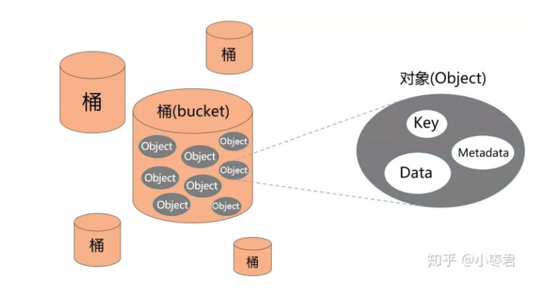
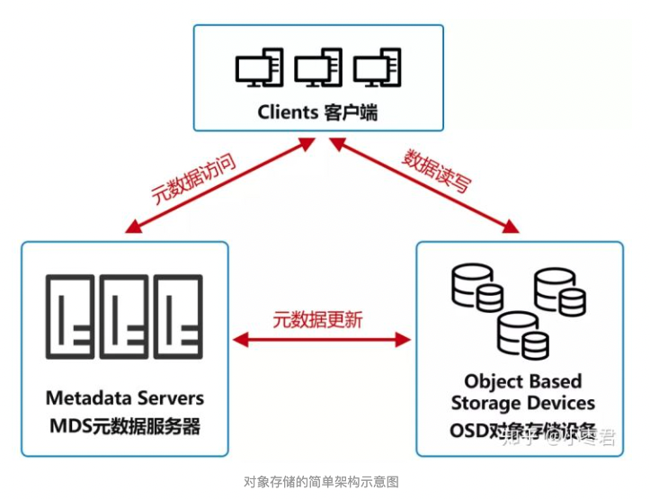

> 参考链接：
>
> https://zhuanlan.zhihu.com/p/166289089

## 1 对象存储的产生

**第一，就是数据量爆炸式增长。**

原因我就不用说了吧？大家可以瞅瞅自己的硬盘，都藏了些什么。

Web应用的崛起、社交需求的刺激，极大地推动了多媒体内容的创作和分享。人们开始上传大量的照片、音乐、视频，加剧了数据量的爆发。

此外，信息技术的发展、企业数字化的落地，也产生了大量的数据，不断吞食着存储资源。

**第二，是非结构化数据的占比显著增加。**

什么是非结构化数据？

举个例子大家就明白了。我们经常做的excel表格，姓名、身高、体重、年龄、性别，这种用二维表结构可以进行逻辑表达的数据，就是结构化数据。

| 用户ID | 用户名 | 性别 | 用户等级 |
| ------ | ------ | ---- | -------- |
| 1      | 张三   | 男   | 10       |
| 2      | 李四   | 女   | 12       |

而图像、音频、视频、word文章、演示胶片这样的数据，就是非结构化数据。

根据此前的预测，到2020年（也就是今年），全球数据总量的80%，将是非结构化数据。

面对这两大趋势，因为本身技术和架构的限制，DAS、SAN和NAS无法进行有效应对。

于是，专家们就搞出了**对象存储**。

## 2 对象存储中的数据组成

对象存储呈现出来的是一个“桶”（bucket），你可以往“桶”里面放“对象（Object）”。这个对象包括三个部分：Key、Data、Metadata。

- **Key**

可以理解文件名，是该对象的全局唯一标识符（UID）。

Key是用于检索对象，服务器和用户不需要知道数据的物理地址，也能通过它找到对象。这种方法极大地简化了数据存储。

下面这行，就是一个对象的地址范例：

看上去就是一个URL网址。如果该对象被设置为“公开”，所有互联网用户都可以通过这个地址访问它。

- **Data**

也就是用户数据本体。这个不用解释了。

- **Metadata**

Metadata叫做元数据，它是对象存储一个非常独特的概念。

元数据有点类似数据的标签，标签的条目类型和数量是没有限制的，可以是对象的各种描述信息。

举个例子，如果对象是一张人物照片，那么元数据可以是姓名、性别、国籍、年龄、拍摄地点、拍摄时间等。

元数据可以有很多

在传统的文件存储里，这类信息属于文件本身，和文件一起封装存储。而对象存储中，元数据是独立出来的，并不在数据内部封装。

元数据的好处非常明显，可以大大加快对象的排序，还有分类和查找。

## 3 对象存储架构

- **OSD对象存储设备**

这是对象存储的核心，具有自己的CPU、内存、网络和磁盘系统。它的主要功能当然是存储数据。同时，它还会利用自己的算力，优化数据分布，并且支持数据预读取，提升磁盘性能。

- **MDS元数据服务器**

它控制Client和OSD的交互，还会管理着限额控制、目录和文件的创建与删除，以及访问控制权限。

- **Client客户端**

提供文件系统接口，方便外部访问。

根据上面的架构可以看出，对象存储系统可以是一个提供海量存储服务的分布式架构。

## 4 对象存储的优点

对象存储的优点很多，简单归纳如下：

- **容量无限大**

对象存储的容量是EB级以上。EB有多大？大家的硬盘普遍是TB级别。1EB约等于1TB的一百万倍，请自行脑补...

对象存储的所有业务、存储节点采用分布式集群方式工作，各功能节点、集群都可以独立扩容。从理论上来说，某个对象存储系统或单个桶（bucket），并没有总数据容量和对象数量的限制。

换句话说，只要你有足够的money，服务商就可以不停地往架构里增加资源，这个存储空间就是无限的。

你可以根据自身需求购买相应大小的对象存储空间。如果需要调整大小，也是支持弹性伸缩的，你不要进行数据迁移和人工干预。

- **数据安全可靠**

对象存储采用了分布式架构，对数据进行多设备冗余存储（至少三个以上节点），实现异地容灾和资源隔离。

根据云服务商的承诺，数据可靠性至少可以达到99.999999999%（不用数了，一共11个9）。这意味着，1000亿个文件里，每月最多只会有1个文件发生数据丢失。这比一个人被陨石击中的概率还要小143000倍。

数据访问方面，所有的桶和对象都有ACL等访问控制策略，所有的连接都支持SSL加密，OBS系统会对访问用户进行身份鉴权。因为数据是分片存储在不同硬盘上的，所以即使有坏人偷了硬盘，也无法还原出完整的对象数据。

- **使用方便**

对于用户来说，对象存储是一个非常方便的存储方式。

很多人把它比喻为“代客泊车”，你只需要把车扔给他，他给你一个凭证，你通过凭证取车就可以了。你不需要知道车库的布局，也不需要自己去费力停放。

数据的存取方法也非常灵活多样。除了前面说的可以使用网页（基于http）直接访问之外，大部分云服务提供商都有自己的图形化界面客户端工具，用户存取数据就像用网盘一样。

事实上，大部分的对象存储需求，并不是个人用户买来当网盘用，而且企业或政府用户用于系统数据存储。例如网站、App的静态图片、音频、视频，还有企业系统的归档数据等。

像这种数据，是通过程序内部的接口调用的。对象存储提供开放的REST API接口。程序员在开发应用时，直接把存储参数写进代码，就可以通过API接口调用对象存储里的数据。相比文件存储那一串串的路径，对象存储要方便很多。

## 5 对象存储的应用场景

他们通常会把存储业务分为3个等级，即标准型、低频型、归档型。对应的应用场景如下：

- 标准类型：移动应用 | 大型网站 | 图片分享 | 热点音视频
- 低频访问类型：移动设备 | 应用与企业数据备份 | 监控数据 | 网盘应用
- 归档类型：各种长期保存的档案数据 | 医疗影像 | 影视素材

根据估算，目前全球互联网70%以上的热点数据是保存在对象存储系统中的。

对象存储虽然看上去很好很强大，但也不是没有缺点。它最大的缺点，和它的工作模式有关。

它是那种把整个数据取出来，修改，再放回去的模式，不支持直接在存储上修改，哪怕只是加一行数据，都不行。所以，它不适合存储需要频繁擦写的数据（例如关系型数据库的数据）。

在数据的一致性保证上，对象存储也存在先天的不足。不过，据说目前技术上已经有了很大改进。