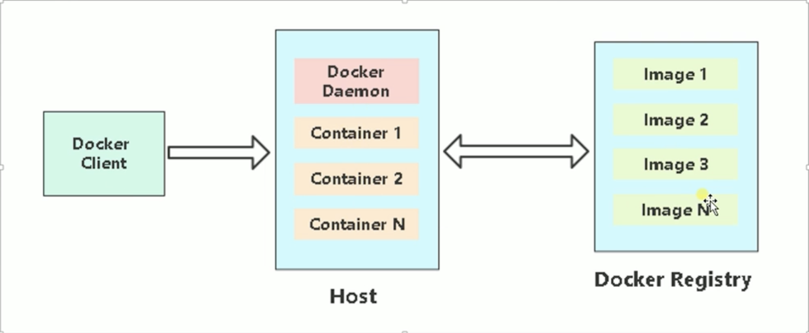

# 一、 为什么使用容器

1. 上限流程繁琐

   > 开发 -> 测试 -> 申请资源 -> 审批 -> 部署 -> 测试等环节。

2. 资源利用率低

   > 普遍服务器利用率低，造成过多浪费。

3. 扩容/所容不及时

   > 业务高峰期扩容流程繁琐，上线不及时

4. 服务器环境臃肿

   > 服务器越来越臃肿，对维护，迁移带来困难

5. 环境不一致

# 二、 docker 是什么

- 使用最广泛的开源容器引擎
- 一种操作系统级别的虚拟化技术
- 依赖于 Linux 内核特性  Namespace（资源隔离）Cgroup（资源限制）
- 一个简单的应用程序打包工具

# 三、 设计目标

- 提供简单的应用程序打包工具
- 开发人员和运维人员职责逻辑分离
- 多环境保持一致

# 四、  Docker 基本组成

- docker client
- docker daemon
- docker image



# 五、 docker 和传统 vm 的区别


|              | Container                                  | VM               |
| ------------ | ------------------------------------------ | ---------------- |
| **启动速度** | 秒级                                       | 分钟级           |
| **运行性能** | 接近原生                                   | 5%左右的损失     |
| **磁盘占用** | MB                                         | GB               |
| **数量**     | 成百上千                                   | 一般几十台       |
| **隔离性**   | 进程级                                     | 系统级（更彻底） |
| **操作系统** | 主要支持 （虚拟化）Linux                   | 几乎所有         |
| **分装程度** | 值大包项目代码和依赖关系，共享宿主机内核。 | 完整操作系统     |

# 六、 Docker 应用场景

- 应程序打包和发布
- 应用程序隔离
- 持续集成
- 部署微fuwu
- 快速搭建测试环境
- 提供 PaaS 产品（平台即服务）

# 七、安装

```shell
yum remove docker \
                  docker-client \
                  docker-client-latest \
                  docker-common \
                  docker-latest \
                  docker-latest-logrotate \
                  docker-logrotate \
                  docker-engine
                  
yum install -y yum-utils
yum-config-manager \
    --add-repo \
    https://download.docker.com/linux/centos/docker-ce.repo
    
yum install docker-ce -y

systemctl start docker
systemctl enable docker
docker info
```

