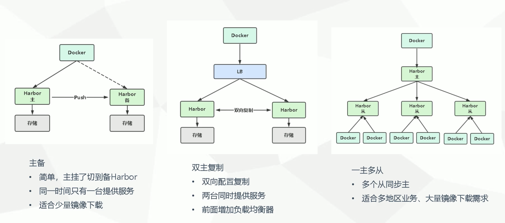

Harbor 是由 VMWare 公司开源的容器镜像仓库。事实上，Harbor 是在 Docker Registry 上进行相应的企业级扩展，从而获得更加广泛的应用，这些新的企业级特性包括：管理用户洁敏啊，基于角色的访问控制， AD/LDAP 集成以及审计日志等，足以满足基本企业需求。

官网：https://goharbor.io

Girhub：https://github.com/goharbor/harbor

# 一、 部署

**服务器硬件配置：**

- 最低要求： CPU2核/内存4G/硬盘40GB
- 推荐： CPU 4核/内存8G/硬盘150GB

**软件：**

- DockerCE 17.06 版本 +
- Docker Compose 1.18版本 + 

**Harbor 安装有两种方式：**

- 在线安装
- 离线安装

## （1） 安装

```shell
1. 环境准备
# 先安装 docker compose
# https://github.com/docker/compose/releases/
wget https://github.com/docker/compose/releases/download/1.29.2/docker-compose-Linux-x86_64
mv docker-compose-Linux-x86_64 /usr/local/bin/docker-compose
chmod +x /usr/local/bin/docker-compose

# 安装 docker
yum install docker-ce -y

2. 安装 harbor 
cd /usr/local
wget https://github.com/goharbor/harbor/releases/download/v2.3.1/harbor-offline-installer-v2.3.1.tgz
tar zxvf harbor-offline-installer-v2.3.1.tgz
cd harbor
cp harbor.yml.tmpl harbor.yml
vi harbor.yml # 注释 https 相关配置

./prepare
./install.sh
```

## （2） Harbor 部署 http

```shell
1. 配置 http 镜像仓库可信任
vi /etc/docker/daemon.json  
{
    "insecure-registries": ["10.0.34.129"]                        # 私有仓库地址
}
systemctl restart docker
docker info           # 查看私有仓库是否添加成功
cd /usr/local/harbor  # docker-compose 需要读取 yml 文件
docker-compose ps     # 查看 docker 重启后是否有容器没有重启成功
docker-compose up -d  # 拉起没有重启成功的容器

2. 打标签
docker tag centos:7 10.0.34.129/library/centos:7

3. 上传
docker push 10.0.34.129/library/centos:7

4. 下载
docker pull 10.0.34.129/library/centos:7

5. 网页端可以查看
http://10.0.34.129/harbor/projects/1/repositories
```

## （3） Harbor 部署 https 

```shell
1. 生成 ssl 证书

cd /usr/local/harbor
mkdir ssl
cd ssl/
# 下载 cfssl 工具
vi cfssl.sh
wget https://pkg.cfssl.org/R1.2/cfssl_linux-amd64
wget https://pkg.cfssl.org/R1.2/cfssljson_linux-amd64
wget https://pkg.cfssl.org/R1.2/cfssl-certinfo_linux-amd64
chmod +x cfssl*
mv cfssl_linux-amd64 /usr/bin/cfssl
mv cfssljson_linux-amd64 /usr/bin/cfssljson
mv cfssl-certinfo_linux-amd64 /usr/bin/cfssl-certinfo
# 生成 证书脚本
vi certs.sh
name=$1
cat > ca-config.json <<EOF
{
    "signing":{
        "default":{
            "expiry": "87600h"
        },
        "profiles":{
            "kubernetes":{
                "expiry": "87600h",
                "usages": [
                    "signing",
                    "key encipherment",
                    "server auth",
                    "client auth"
                ]
            }
        }
    }
}
EOF
cat > ca-csr.json <<EOF
{
    "CN": "kubernetes",
    "key":{
        "algo": "rsa",
        "size": 2048
    },
    "names":[
        {
            "C": "CN",
            "L": "Beijing",
            "ST": "Beijing"
        }
    ],
    "ca":{
        "expiry": "87600h"
    }
}
EOF
# 根据 json 生成 ca 证书
cfssl gencert -initca ca-csr.json | cfssljson -bare ca -
cat > ${name}-csr.json <<EOF
{
    "CN": "${name}",
    "hosts": ["${name}"],
    "key": {
        "algo": "rsa",
        "size": 2048
    },
    "names": [
        {
            "C": "CN",
            "ST": "Beijing",
            "L": "Beijing"
        }
    ]
}
EOF
# 使用 ca 证书 根据 json 生成 证书
cfssl gencert -ca=ca.pem -ca-key=ca-key.pem -config=ca-config.json -profile=kubernetes ${name}-csr.json | cfssljson -bare ${name}

# 执行生成密钥脚本
sh cfssl.sh
# name 随意指定 但需要与 harbor 指定的域名一致
sh certs.sh www.bosheng.com

2. Harbor 启用 HTTPS
vi harbor.html
https:
  port: 443
  certificate: /usr/local/harbor/ssl/10.0.34.129.pem
  private_key: /usr/local/harbor/ssl/10.0.34.129-key.pem

3. 重新配置并部署 Harbor
./prepare
docker-compose down
docker-compose up -d
访问 10.0.34.129

4. 将数字证书 copy 到客户端
mkdir -p /etc/docker/certs.d/10.0.34.129
mv /root/10.0.34.129.pem /etc/docker/certs.d/10.0.34.129/10.0.34.129.crt

5. login 测试
docker login www.bosheng.com -u admin -p Harbor12345

```

## （4） 主从复制



### a 主备

```shell
1. 两台机器安装 harbor docker docker-compose 并启动

2. 配置 dnsmasq  # 主机 hosts 文件容器无法读取 需更改主机 dns 以让容器可以通过域名做主备
yum -y install dnsmasq
# 指定配置文件位置
vim /etc/dnsmasq.conf 
addn-hosts=/etc/domains

#  修改 /etc/domains 文件, 格式同 hosts 文件相同, IP 地址对应主机域名
vim /etc/domains
10.0.34.129 www.bosheng1.com
10.0.34.130 www.bosheng2.com
10.0.34.131 www.bosheng3.com
10.0.34.132 www.bosheng4.com

3. web 端创建仓库和复制信息 （事件驱动为上传镜像自动同步）
```

## （5） harbor 组件

| 容器              | 功能                                       |
| ----------------- | ------------------------------------------ |
| harbor-core       | 配置管理中心                               |
| harbor-db         | PG数据库                                   |
| harbor-jobservice | 负责镜像复制                               |
| harbor-log        | 记录操作日志                               |
| harbor-portal     | web 管理见面和 api                         |
| nginx             | 前端代理，负责前端页面和镜像上传/下载/转发 |
| redis             | 会话                                       |
| registryctl       | 镜像存储                                   |

容器数据持久化目录 ：/data/

日志文件目录： /var/log/harbor

用户数据存储在主PG 需要定期备份