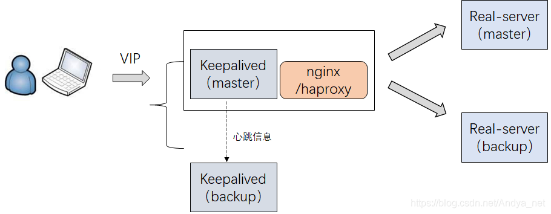

# keepalived介绍

  keepalived是基于`VRRP`（Virtual Router Redundancy Protocol ，虚拟路由器冗余协议）协议实现的`LVS`（LinuxVirtual Server ，Linux虚拟服务器）服务高可用方案。主要提供了负载均衡和高可用功能，用来避免单点故障。负载均衡是通过linux的IPVS（ip虚拟服务器）实现，高可用通过VRRP实现多机故障转移。
  keepalived一般是2个节点运行keepalived，一台是`主节点（MASTER`）,一台是`备节点（BACKUP）`，`对外`表现都是`一个虚拟IP`，主节点会发送特定的消息给备节点，如果备节点收不到这个特定消息时，说明`主节点就宕机`了，此时`备节点就会接管虚拟IP`进行服务提供，这就实现了高可用。

# keepalived使用架构图

将keepalived和nginx部署在一台服务器。

# keepalived高可用故障切换转移

  keepalived是基于VRRP协议来实现高可用的，有两种模式，一种是`抢占模式`（默认使用），另一种是`非抢占模式`，需配置`nopreempt`，在后面的keepalived配置文件详解中我们会讲到。当使用`抢占模式`的时候，这是一种`竞选机制`进行通信，`主节点优先级大于备节点优先级`。当主节点宕机的时候，可以切到备节点进行提供服务。

**`抢占模式原理`如下**：

1. keepalived正常工作的时候，MASTER主节点会向BACKUP备节点不断的发送特定消息（`多播心跳消息`），就是一种`健康检查机制`，告诉备节点“`我还活着，虚拟IP我来管就行了！`”。
2. 当主节点发生故障出现宕机情况的时候，无法向备节点发送心跳信息，备节点无法收到主节点的健康检查心跳信息，这个时候，备节点终于转正了，机会来了，就接管虚拟IP进行服务提供。
3. 当主节点故障恢复后，又不断的发送心跳给备节点，告知“`我现在活着呢，我来管虚拟IP`”，`备节点就会释放`主节点宕机时所接管的`IP资源以及服务`，默默的`做回一个备胎`。