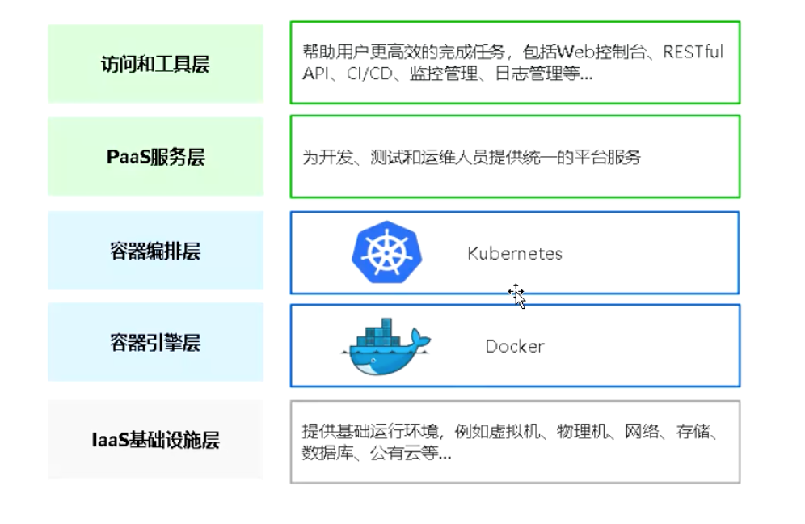
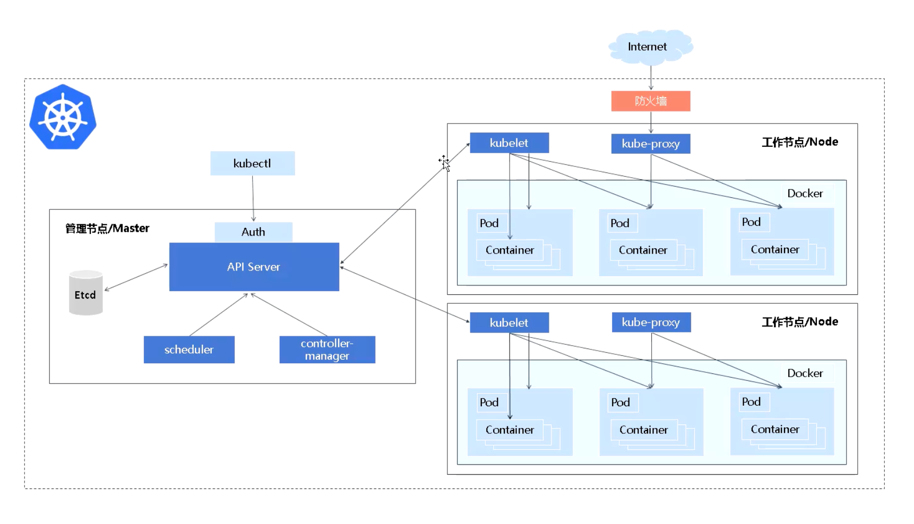
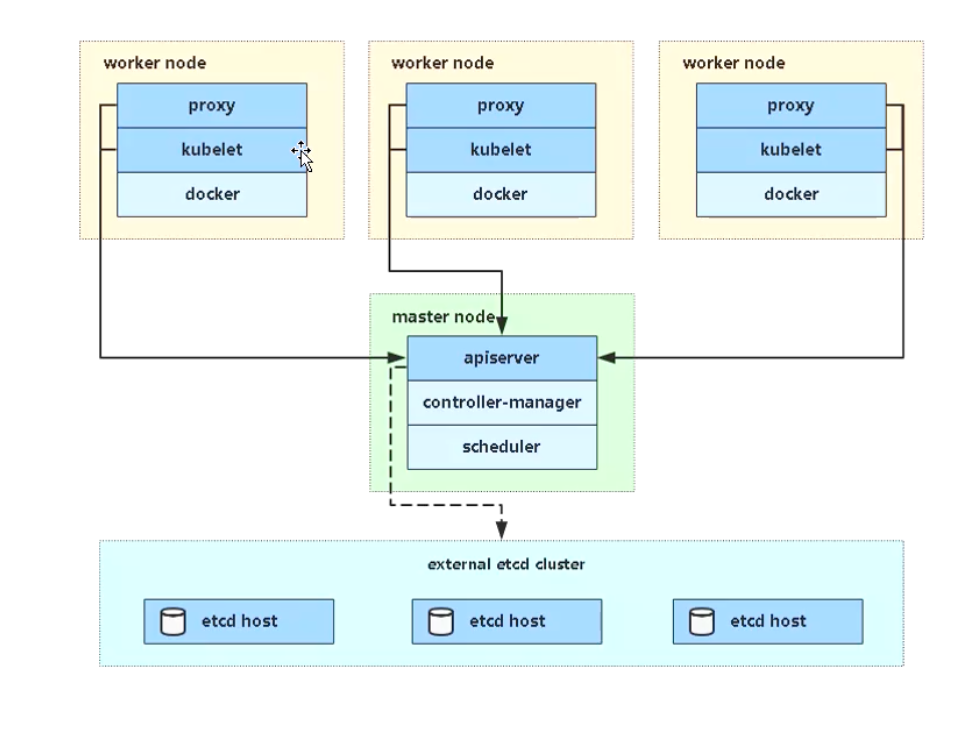
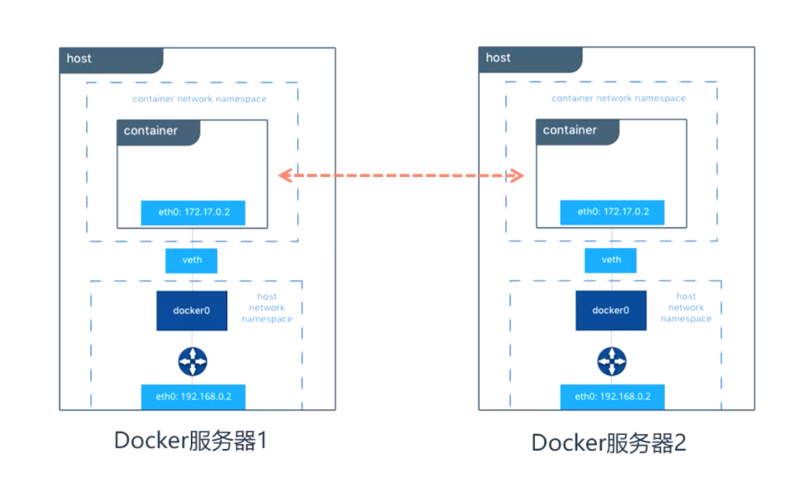
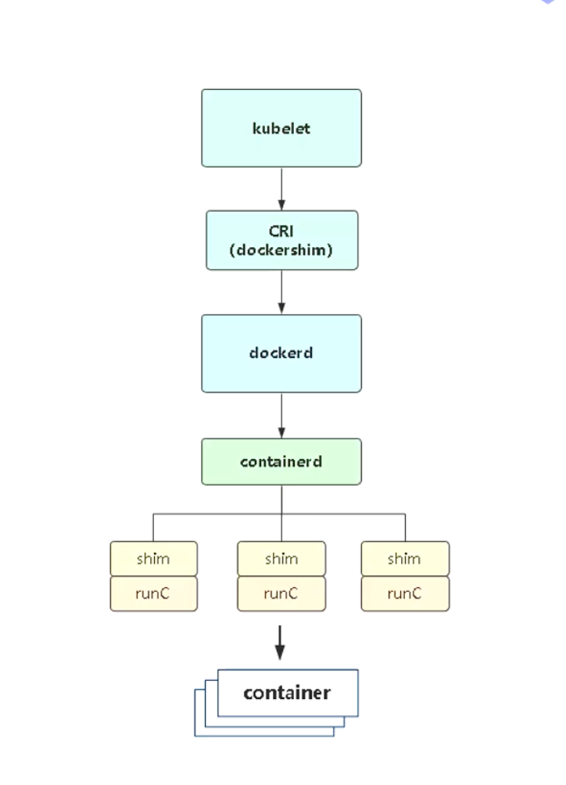

> 参考： 
>
> 阿良
>
> https://juejin.cn/post/7007362174843060255

## 1 Kubernetes 核心概念

**有了 docker 为什么要用 kubernetes？**

> 企业需求： 为提高业务并发和高可用，会使用多台服务器，因此会面向这些问题。

- 多容器跨主机如何提供服务？
- 多容器如何分布式部署到节点？
- 多主机多容器怎么升级？
- 怎么高效管理这些容器？

为了解决这些问题，引入了容器编排系统：

- kubernetes
- swarm
- mesos marathon

## 2 Kubernetes 是什么

>  Kubernetes 是 Google 在 2014 年开园的一个容器集群管理系统， Kubernetes 简称 K8s
>
>  Kubernetes 用于容器化应用程序的部署，扩展和管理，目标是让部署容器化应用简单高效。
>
> 官方网站： http://www.kubernetes.io
>
> 官方文档： https://kubernetes.io/docs/home/

#### Master 组件

- kube-apiserver

kubernetes api， 集群的统一入口，各组件协调者，以RESTful API 提供接口服务，所有对象资源的增删改查和监听操作都交给 API server 处理后再提交给 Etcd 存储。K8s集群资源操作提供唯一入口，并提供认证、授权、访问控制、API 注册和发现机制。

- kube-controller-manager

k8s在后台运行许多不同的控制器进程，当服务配置发生更改时（例如，替换运行 pod 的镜像，或更改配置 yaml 文件中的参数），控制器会发现更改并开始朝着新的期望状态工作。

从逻辑上讲，每个控制器都是一个单独的进程， 但是为了降低复杂性，它们都被编译到同一个可执行文件，并在一个进程中运行。

控制器包括:

节点控制器（Node Controller）: 负责在节点出现故障时进行通知和响应

任务控制器（Job controller）: 监测代表一次性任务的 Job 对象，然后创建 Pods 来运行这些任务直至完成

端点控制器（Endpoints Controller）: 填充端点(Endpoints)对象(即加入 Service 与 Pod)

服务帐户和令牌控制器（Service Account & Token Controllers）: 为新的命名空间创建默认帐户和 API 访问令牌

- kube-scheduler

kube-scheduler 负责监视新创建、未指定运行Node的 Pods，决策出一个让pod运行的节点。

例如，如果应用程序需要 1GB 内存和 2 个 CPU 内核，那么该应用程序的 pod 将被安排在至少具有这些资源的节点上。每次需要调度 pod 时，调度程序都会运行。调度程序必须知道可用的总资源以及分配给每个节点上现有工作负载的资源。

调度决策考虑的因素包括单个 Pod 和 Pod 集合的资源需求、硬件/软件/策略约束、亲和性和反亲和性规范、数据位置、工作负载间的干扰和最后时限。

- etcd

etcd 是兼具一致性和高可用性的键值数据库，可以作为保存 Kubernetes 所有集群数据的后台数据库(例如 Pod 的数量、状态、命名空间等）、API 对象和服务发现细节。 在生产级k8s中etcd通常会以集群的方式存在，安全原因，它只能从 API 服务器访问。

#### Node 组件

- kubelet

kubelet 是 master 在 node 节点上的agent，管理本机运行容器的生命周期，比如创建容器， pod 挂载数据卷， 下载 secret， 获取容器和节点状态等工作。 kubelet 将每个 pod 转换成一组容器。

- kube-proxy

在 node 节点上实现 pod 网络代理，维护网络规则和四层负载均衡工作。

- 第三方容器引擎：docker 、 containerd、 podman

容器引擎，运行容器。

## 3 网络组件起什么作用

面临的问题：

- 容器都还有自己的内网，容器1 数据包如何转发到 容器2。
- 每个 docker 的网络是独立管理。

​	

部署网络组件的目的是打通 pod 到 pod 之间网络， node 和 pod 之间网络， 从而集群中的数据包可以任意传输，形成一个扁平化网络。

主流的网络组件有： Flannel ， Calico 等。

而所谓的 CNI （Container Network Interface） 就是 k8s 对接这些第三方网络组件的接口。

## 4 Kubernetes 将弃用 Docker

在 kubernetes 平台中，为了解决容器运行时（例如 docker） 集成问题， 在早期社区推出了 CRI（Container Runtime Interface 容器运行时接口），以支持更多的容器运行时。

当我们使用 docker 作为容器运行时之后，架构是这样的，如图所示。

Kubernetes 计划弃用就是 kubelet 中 dockershim。 即 kubernetes kubelet 实现中的组件之一，它能够与 docker engine 进行通信。

**为什么这么做？**

- docker 内部调用链比较复杂，多层封装和调用，导致性能降低，提升故障率，不易排查
- docker 还会在宿主机创建网络规则，存储卷，也带来安全隐患

**如何应对？**

在未来 kubernetes 版本彻底放弃 docker 支持之前，引入受支持的容器运行时。

除了 docker 之外， cri 还支持很多容器运行时，例如：

- containerd： containerd 与 docker 相兼容，相比 docker 轻量很多，目前较为成熟。
- cri-o，podman： 都是红帽（RedHat）项目，目前红帽主推 podman

