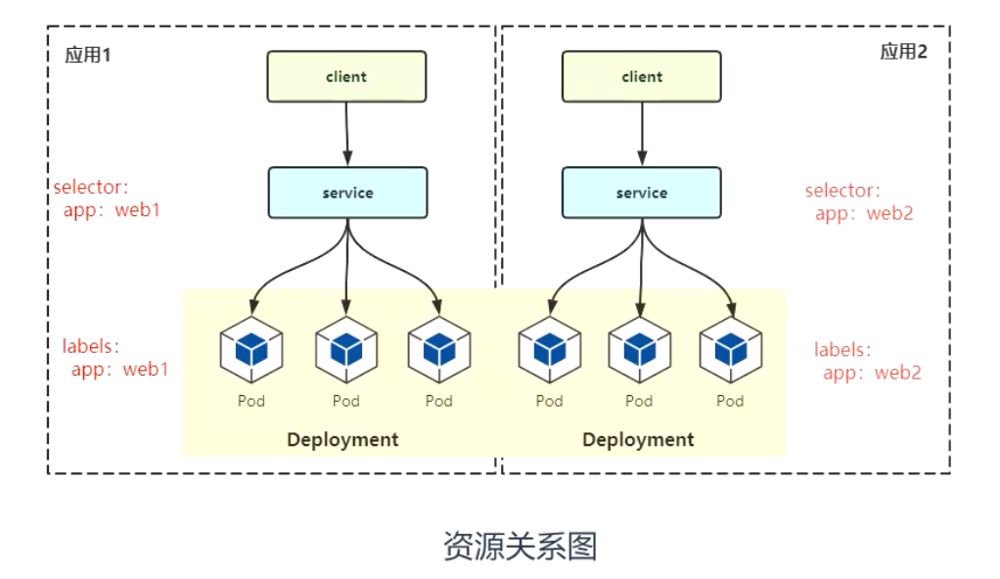

### Pod

kubernetes 最小部署单元，一组容器的集合

### Deployment

最常见的控制器，用于更高级别部署和管理 Pod

### Service

为一组 Pod 提供负载均衡，对外提供统一访问入口

### Label

标签，附加到某个资源上，用于关联对象，查询和筛选

### Namespaces

> kubernetes 将资源对象逻辑上隔离，从而形成多个虚拟集群，还可以实现权限控制。

**应用场景：**

- 根据不同团队分命名空间
- 根据项目划分命名空间

**命令：**

```shell
kubectl get namespace
- default ： 默认命名空间
- kube-system ： kubernetes 系统方面命名空间
- kube-public ： 公开的命名空间，谁都可以访问
- kube-node-lease ： kubernetes 内部命名空间

# 两种方法指定资源命名空间
- 命令行加 -n
- yaml 资源元数据里制定 namespace 字段
```

