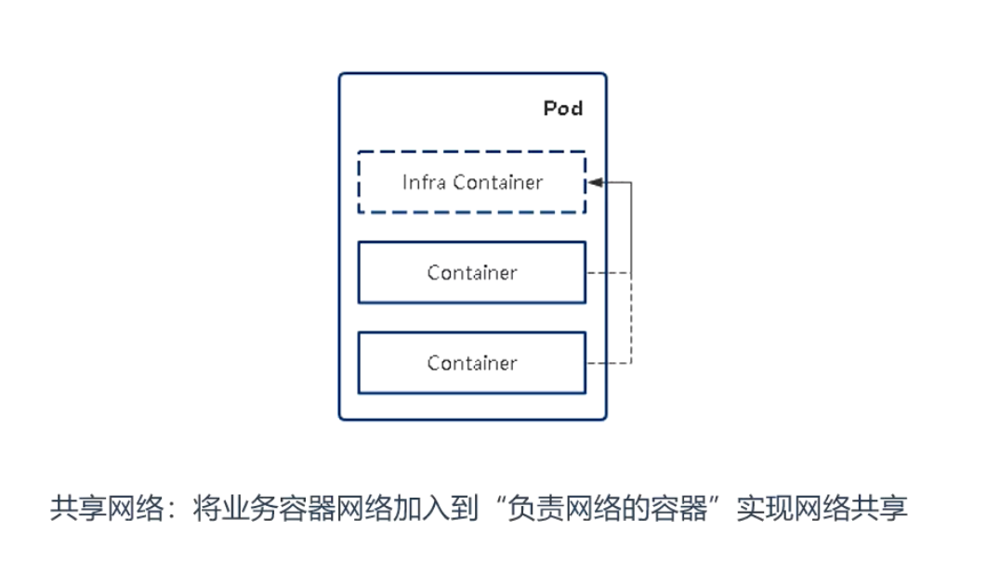
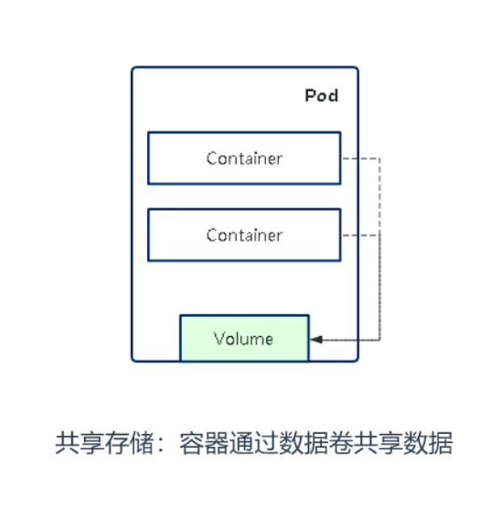
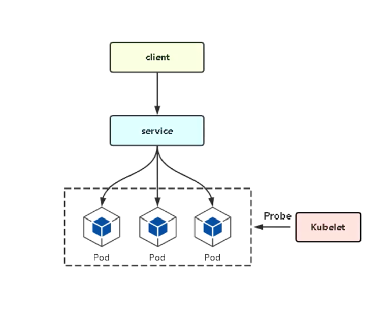
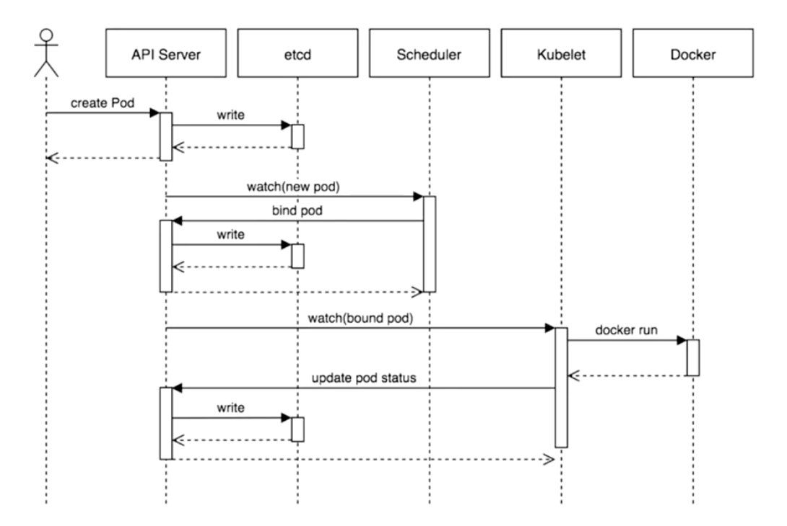

## 1 深入理解 Pod 对象

### 1.1 基本管理

#### 1.1.1 Pod 基本概念

Pod 是一个逻辑抽象的概念，Kubernetes 创建和管理的最小单元，一个 Pod 由一个容器或多个容器组成。


**Pod 特点：**

- 一个 Pod 可以理解为一个应用实例，提供服务。
- Pod 重容器始终部署在一个 Node 上。
- Pod 重容器共享网络、 存储资源。

#### 1.1.2 Pod 存在的意义

Pod 主要用法：

- 运行单个容器：最常见的用法，在这种情况下，可以将 Pod 看做是单个容器的抽象封装。
- 运行多个容器： 属于边车模式（Sidecar），通过 Pod 中定义专门容器，来执行主业务容器需要的辅助工作，这样的好处是将辅助功能同主业务解耦，实现独立发布和能力重用。例如：
  - 日志收集
  - 应用监控

#### 1.1.3 Pod 资源共享实现机制



> 使用如下 yaml 文件创建容器，连接进去，netast  -tlanp 测试

```yaml
apiVersion: v1
kind: Pod
metadata:
  labels:
    app: test
  name: pod-net-test
  namespace: study
spec:
  containers:
  - image: busybox
    name: test
    command: ["/bin/sh", "-c", "sleep 12h"]
  - image: nginx
    name: web
```




> 使用如下 yaml 文件创建容器，连接进去，在挂载目录创建文件测试

```yaml
apiVersion: v1
kind: Pod
metadata:
  labels:
    app: test
  name: pod-volume-test
  namespace: study
spec:
  containers:
  - image: busybox
    name: test
    command: ["/bin/sh", "-c", "sleep 12h"]
    volumeMounts:
    - name: log
      mountPath: /data
  - image: nginx
    name: web
    volumeMounts:
    - name: log
      mountPath: /usr/share/nginx/html
  volumes:
    - name: log
      emptyDir: {}
```


#### 1.1.4 Pod 管理命令

**创建 Pod：**

```shell
kubectl apply -f pod.yaml
kubectl run nginx --image=nginx
```

**查看 Pod：**

```shell
kubectl get pods
kubectl describe pod <pod name>
```

**查看日志：**

```shell
kubectl logs <pod name> [-c container]
kubectl logs <pod name> [-c container] -f
```

**进入容器终端：**

```shell
kubectl exec <pod name> [-c container] -- bash
```

**删除 Pod：**

```shell
kubectl delete -f pod.yaml
kubectl delete <pod name>
```


#### 1.1.5 重启策略 + 健康检查



**重启策略（restartPolicy）：**

- Always： 当容器终止退出后，总是重启容器，默认策略。
- OnFailure： 当容器异常退出（退出状态码非0）时，才重启容器。
- Never： 当容器终止退出。从不重启容器。

**健康检查类型：**

- livernessProbe（存活检查）： 如果检查失败，将杀死容器， 根据 Pod restartPolicy来操作。
- readinessProbe（就绪检查）： 如果检查失败， kubernetes 就会吧 pod 从 service endpoints 中剔除

**支持的检查方法：**

- httpGet； 发送 HTTP 请求，返回 200-400范围状态码为成功。
- exec： 执行 Shell 命令返回状态码是 0 为成功。
- tcpSocket： 发起 TCP Socket 建立成功。

> 如下为健康检查 yaml 示例

**端口探测**

```yaml
apiVersion: v1
kind: Pod
metadata:
  name: probe-demo
spec:
  containers:
  - name: web
    image: nginx
    ports:
    - containerPort: 80
    livenessProbe:
      tcpSocket:
        port: 80
      initialDelaySeconds: 30  # 启动容器多少秒后健康检查
      periodSeconds: 10        # 以后间隔多少秒检查一次
    readinessProbe:
      tcpSocket:
        port: 80
      initialDelaySeconds: 30
      periodSeconds: 10
```

**Shell**

```yaml
livenessProbe:
  exec:
    command:
    - cat
    - /tmp/healthy
```

**HTTP**

```yaml
livenessProbe:
  httpGet:
    path: /healthz
    port: 8080
    httpHeaders:
    - name: Custom-Header
      value: Awesome
```


#### 1.1.6 环境变量

> 创建 Pod 时， 可以为旗下的容器设置环境变量。

**应用场景：**

- 容器内应用程序希望获取 Pod 信息
- 容器内应用程序希望通过用户定义的变量改变默认行为

**变量值几种定义方式：**

- 自定义变量值
- 变量值从 Pod 属性获取
- 变量值从 Secret、 ConfigMap 获取

```yaml
apiVersion: v1
kind: Pod
metadata:
  name: pod-envars
spec:
  containers:
  - name: test
    image: busybox
    command: ["sh", "-c", "sleep 36000"]
    env:
    # 变量值从 Pod 属性获取
    - name: MY_NODE_NAME
      valueFrom:
        fieldRef:
          fieldPath: spec.nodeName
    - name: MY_POD_NAME
      valueFrom:
        fieldRef:
          fieldPath: metadata.name
    - name: MY_POD_NAMESPACE
      valueFrom:
        fieldRef:
          fieldPath: metadata.namespace
    - name: MY_POD_IP
      valueFrom:
        fieldRef:
          fieldPath: status.podIP
    # 自定义变量值
    - name: ABC
      value: "123456"
```

**测试**

```shell
# kubectl exec -it pod-envars -- sh
/ # echo $MY_NODE_NAME
kubernetes-node-2
/ # echo $MY_POD_NAME
pod-envars
/ # echo $MY_POD_NAMESPACE
default
/ # echo $MY_POD_IP
10.244.20.97
/ # echo $ABC
123456
```


#### 1.1.7 Init Container

> 顾名思义，用于初始化工作，执行完就结束，可以理解为一次性任务。
>
> - 支持大部分应用容器配置，但是不支持健康检查
> - 优先应用容器执行

**应用场景：**

- 环境检查： 例如确保应用容器以来的服务启动后再启动应用容器
- 初始化配置： 例如给应用容器准备配置文件


**示例：**

> 部署一个 web 网站， 网站程序没有打包到镜像中， 而是希望从代码仓库中动态拉取放到应用容器中。

```yaml
apiVersion: v1
kind: Pod
metadata:
  name: init-demo
spec:
  initContainers:
  - name: download
    image: busybox
    command:
    - wget
    - "-O"
    - "/opt/index.html"
    - http://www.ctnrs.com
    volumeMounts:
    - name: wwwroot
      mountPath: "/opt"
  containers:
  - name: nginx
    image: nginx
    ports:
    - containerPort: 80
    volumeMounts:
    - name: wwwroot
      mountPath: /usr/share/nginx/html
  volumes:
  - name: wwwroot
    emptyDir: {}
```


#### 1.1.8 Pod 容器类型

因此， Pod 中会有这几种类型的容器：

-  Infrastructure Container： 基础容器
  - 维护整个 Pod 的网络空间
- InitContainer： 初始化容器
  - 先于业务容器开始执行
- Containers： 业务容器
  - 并行启动


### 1.2 调度

#### 1.2.1 创建一个 Pod 的工作流程

kubernetes 基于 list-watch 机制的控制器架构，实现组件间交互的解耦。

其他组件监控自己负责的资源，当这些资源放生变化时，kube-apiserver 会通知这些组件，这个过程类似于发布与订阅。



1. kubectl run 创建一个 pod， 将请求交给 apiserver， aposerver 存储在 etcd
2. scheduler 从 apiserver 中获取未分配的 pod， 根据自身的调度算法选择一个合适的节点，给这个 pod 打个标记 nodeName=kubernetes-node2， 返回给 apiserver， apiserver 存储在 etcd
3. kubelet 从 api server 中获取分配到自己的 pod （nodeName=kubernetes-node2）
4. kubelet 调用 docker api 创建容器， 将容器运行状态返回给 apiserver， apiserver 存储在 etcd
5. kubectl get pods 就是拿 etcd 存储的状态


#### 1.2.2  Pod 中影响调度的主要属性

- spec.containers.resources
- 

#### 1.2.3 资源限制对 Pod 调度的影响

容器资源限制：

- resources.limits.cpu
- resources.limits.memory

容器使用的最小资源需求，作为容器调度时资源分配的依据：

- resources.requests.cpu
- resources.resquests.memory

```shell
apiVersion: v1
kind: Pod
metadata:
  name: web
spec:
  containers:
  - name: web
    image: nginx
    resources:
      requests:
        memory: "64Mi"
        cpu: "250m"
      limits:
        memory: "128Mi"
        cpu: "500m"
# CPU 单位: 可以写 m 也可以写浮点数， 例如 0,5=500m, 1=1000m
```

> k8s 会根据 request 的值去查找有足够资源你的 node 来调度此 pod

```shell
# 验证
kubectl describe pod web
```

**注意：**

1. limits 要比 requests 设置哒，不能比他小
2. 一般 limits 值设置大雨 requests 的 20%～30%
3. requests 相当于预分配资源（不是实际占用）
4. limits 不能设置太大，否则会导致资源超卖，达不到限制效果


#### 1.2.4 nodeSelector & nodeAffinity

##### 1.2.4.1 nodeSelector

用于将 Pod 调度到匹配 Label 的 Node 上， 如果没有匹配的标签则会调度失败

**作用：**

- 约束 Pod 到特定的节点运行
- 完全匹配节点标签

**应用场景：**

- 专用节点： 根据业务线将 Node 分组管理
- 配备特殊硬件： 部分 Node 配有 SSB 硬盘， GPU

**将节点打标签：**

```shell
kubectl label node kubernetes-node-1 disktype=ssd
```

**查看节点标签：**

```shell
kubectl get node --show-labels
```

**指定具有指定 label 的 node 创建 pod：**

```yaml
apiVersion: v1
kind: Pod
metadata:
  creationTimestamp: null
  labels:
    run: web
  name: web
spec:
  nodeSelector:
    disktype: "ssd"
  containers:
  - image: nginx
    name: web
```

**检查：**

```shell
kubectl get pods -o wide
```

##### 1.2.4.2 nodeAffinity

节点亲和性， 与 nodeSelector 作用一样， 但相比更加灵活，满足更多条件，诸如：

- 匹配有更多的逻辑组合，不止是字符串的完全相等，支持的操作符
  - In、 NotIn、 Exists、 DoesNotExist、 Gt、 Lt
- 调度策略氛围软策略和硬策略，而不是硬性要求
  - 硬（required）： 必须满足
  - 软（preferred）： 尝试满足，但不保证

```

```


#### 1.2.5 Taint （污点）& Tolerations （污点容忍）

#### 1.2.6 nodeName