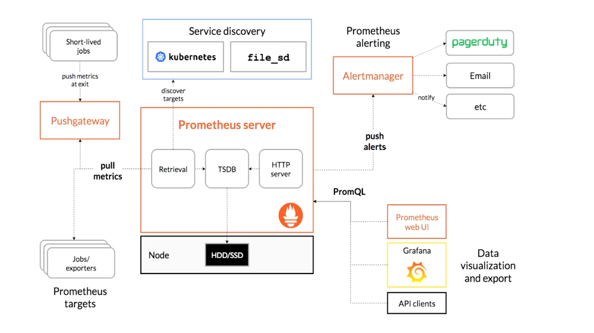
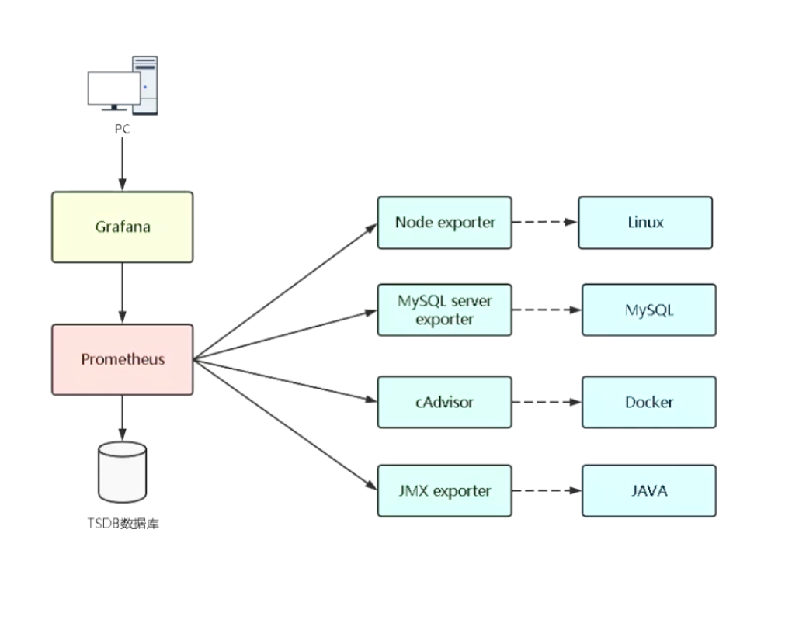
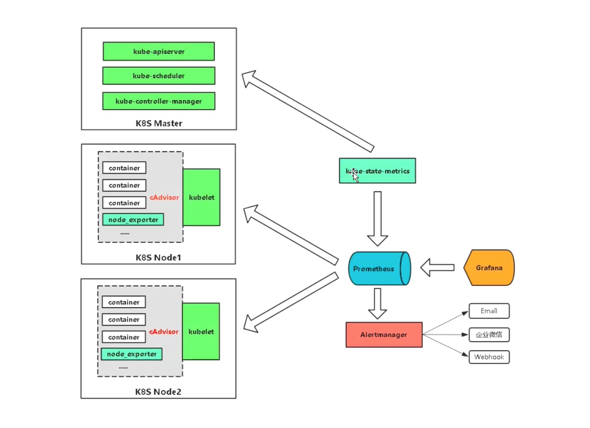

### 1 prometheus 介绍

Prometheus 是一个最初在 sound cloud 上构建的监控系统。自 2012 年成为社区开源项目，拥有非常活跃的开发人员和用户社区。为强调开源及独立维护， prometheus 与 2016 年加入 云原生云计算基金会 （CNCF）， 成为继 kubernetes 之后的第二个托管项目。

https://prometheus.io

https://github.com/prometheus

### 2 prometheus 组件与架构

### 3 prometheus 基本使用

如果想要监控，前提是能够获取被监控端指标数据，并且这个数据格式必须遵循 Prometheus 数据模型， 这样才能识别和采集，一般使用 exporter 提供监控指标数据。

exporter 列表： https://prometheus.io/docs/instrumenting/exporters

PromQL 是 prometheus 自己开发的数据查询 DSL 语言， 语言表现力非常风物，支持条件查询，操作符，并且内建了大量的内置函数，供我们针对监控数据的各种维度进行查询。

**数据模型：**

-  prometheus 将所有数据存储为时间序列
- 具有相同度量名称以及标签属于同一个指标
- 每一个时间序列都由度量标准名称和一组简直对（成为标签）唯一标识，通过标签查询指定指标。

**指标格式：**

`<metric name> { <label name> = <label value>, ...}`

### 4 kubernetes 监控指标

**kubernetes 本身监控**

- node 资源利用率
- node 数量
- 每个 node 运行 pod 数量
-  资源对象状态

**pod 监控**

- pod 总数量及每个控制器预期的数量
- pod 状态
- 容器资源利用率： cpu 、 内存、网络 

### 5 kubernetes 监控思路

| 监控指标            | 具体实现           | 举例                         |
| ------------------- | ------------------ | ---------------------------- |
| pod 性能            | cAdvisor           | cpu、 内存、 网络等          |
| node 性能           | node-exporter      | cpu、 内存、 网络等          |
| kubernetes 资源对象 | kube-state-metrics | pod、deployment、 service 等 |

- pod

kubelet 的几点使用 cAdvisor 提供的 metrics 接口获取该节点所有 Pod 和容器相关的性能指标数据

指标接口: https://nodeip:10250/metrics/cadvisor

- node

使用 node_exporter 收集器采集节点资源利用率

项目地址: https://github.com/prometheus/node_exporter

- kubernetes 资源对象

kube-state-metrics 采集了 kubernetes 中各种资源对象的状态信息

项目地址: https://github.com/kubernetes/kube-state-metrics