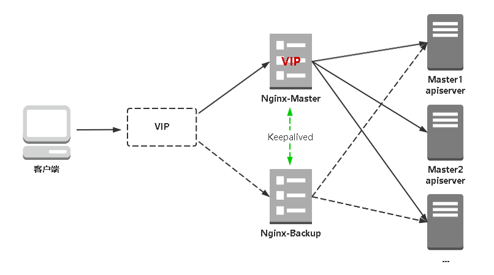

### 1 架构图




### 2 安装软件包

```shell
 yum install epel-release -y
 yum install nginx keepalived -y
 yum install nginx-mod-stream -y
```


### 3 Nginx 配置文件

```shell
cat > /etc/nginx/nginx.conf << "EOF"
user nginx;
worker_processes auto;
error_log /var/log/nginx/error.log;
pid /run/nginx.pid;

include /usr/share/nginx/modules/*.conf;

events {
    worker_connections 1024;
}

# 四层负载均衡，为两台Master apiserver组件提供负载均衡
stream {

    log_format  main  '$remote_addr $upstream_addr - [$time_local] $status $upstream_bytes_sent';

    access_log  /var/log/nginx/k8s-access.log  main;

    upstream k8s-apiserver {
       server 192.168.122.210:6443;   # Master1 APISERVER IP:PORT
       server 192.168.122.211:6443;   # Master2 APISERVER IP:PORT
    }
    
    server {
       listen 16443; # 由于nginx与master节点复用，这个监听端口不能是6443，否则会冲突
       proxy_pass k8s-apiserver;
    }
}

http {
    log_format  main  '$remote_addr - $remote_user [$time_local] "$request" '
                      '$status $body_bytes_sent "$http_referer" '
                      '"$http_user_agent" "$http_x_forwarded_for"';

    access_log  /var/log/nginx/access.log  main;

    sendfile            on;
    tcp_nopush          on;
    tcp_nodelay         on;
    keepalive_timeout   65;
    types_hash_max_size 2048;

    include             /etc/nginx/mime.types;
    default_type        application/octet-stream;

    server {
        listen       80 default_server;
        server_name  _;

        location / {
        }
    }
}
EOF
```


###  4 keepalived 配置

#### 4.1 准备存错状态检查脚本

```shell
cat > /etc/keepalived/check_nginx.sh  << "EOF"
#!/bin/bash
count=$(ss -antp |grep 16443 |egrep -cv "grep|$$")

if [ "$count" -eq 0 ];then
    exit 1
else
    exit 0
fi
EOF
chmod +x /etc/keepalived/check_nginx.sh
```


#### 4.2 master keepalived 配置

```shell
cat > /etc/keepalived/keepalived.conf << EOF
global_defs { 
   notification_email { 
     acassen@firewall.loc 
     failover@firewall.loc 
     sysadmin@firewall.loc 
   } 
   notification_email_from Alexandre.Cassen@firewall.loc  
   smtp_server 127.0.0.1 
   smtp_connect_timeout 30 
   router_id NGINX_MASTER
} 

vrrp_script check_nginx {
    script "/etc/keepalived/check_nginx.sh"
}

vrrp_instance VI_1 { 
    state MASTER 
    interface ens3   # 修改为实际网卡名
    virtual_router_id 51 # VRRP 路由 ID实例，每个实例是唯一的 
    priority 100    # 优先级，备服务器设置 90 
    advert_int 1    # 指定VRRP 心跳包通告间隔时间，默认1秒 
    authentication { 
        auth_type PASS      
        auth_pass 1111 
    }  
    # 虚拟IP
    virtual_ipaddress { 
        192.168.122.240/24
    }
    track_script {
        check_nginx
    } 
}
EOF

# vrrp_script：指定检查nginx工作状态脚本（根据nginx状态判断是否故障转移）
# virtual_ipaddress：虚拟IP（VIP）
```


#### 4.3 backup keepalived 配置

```shell
cat > /etc/keepalived/keepalived.conf << EOF
global_defs { 
   notification_email { 
     acassen@firewall.loc 
     failover@firewall.loc 
     sysadmin@firewall.loc 
   } 
   notification_email_from Alexandre.Cassen@firewall.loc  
   smtp_server 127.0.0.1 
   smtp_connect_timeout 30 
   router_id NGINX_BACKUP
} 

vrrp_script check_nginx {
    script "/etc/keepalived/check_nginx.sh"
}

vrrp_instance VI_1 { 
    state BACKUP 
    interface ens3
    virtual_router_id 51 # VRRP 路由 ID实例，每个实例是唯一的 
    priority 90
    advert_int 1
    authentication { 
        auth_type PASS      
        auth_pass 1111 
    }  
    virtual_ipaddress { 
        192.168.122.240/24
    } 
    track_script {
        check_nginx
    } 
}
EOF
```


#### 4.4 查看 keepalived 工作状态

```shell
1: lo: <LOOPBACK,UP,LOWER_UP> mtu 65536 qdisc noqueue state UNKNOWN group default qlen 1000
    link/loopback 00:00:00:00:00:00 brd 00:00:00:00:00:00
    inet 127.0.0.1/8 scope host lo
       valid_lft forever preferred_lft forever
    inet6 ::1/128 scope host
       valid_lft forever preferred_lft forever
2: ens3: <BROADCAST,MULTICAST,UP,LOWER_UP> mtu 1500 qdisc pfifo_fast state UP group default qlen 1000
    link/ether 52:54:00:66:59:82 brd ff:ff:ff:ff:ff:ff
    inet 192.168.122.210/24 brd 192.168.122.255 scope global noprefixroute ens3
       valid_lft forever preferred_lft forever
    inet 192.168.122.240/24 scope global secondary ens3
       valid_lft forever preferred_lft forever
    inet6 fe80::5054:ff:fe66:5982/64 scope link
       valid_lft forever preferred_lft forever
3: docker0: <NO-CARRIER,BROADCAST,MULTICAST,UP> mtu 1500 qdisc noqueue state DOWN group default
    link/ether 02:42:5f:23:b3:49 brd ff:ff:ff:ff:ff:ff
    inet 172.17.0.1/16 brd 172.17.255.255 scope global docker0
       valid_lft forever preferred_lft forever
```

### 5 测试访问

```shell
# curl -k https://192.168.122.240:16443/version
{
  "major": "1",
  "minor": "20",
  "gitVersion": "v1.20.15",
  "gitCommit": "8f1e5bf0b9729a899b8df86249b56e2c74aebc55",
  "gitTreeState": "clean",
  "buildDate": "2022-01-19T17:23:01Z",
  "goVersion": "go1.15.15",
  "compiler": "gc",
  "platform": "linux/amd64"
}


# 查看nginx 日志
# tail /var/log/nginx/k8s-access.log -f
```

### 6 修改所有 work node 连接 LB VIP

```shell
sed -i 's#192.168.122.211:6443#192.168.122.240:16443#' /usr/local/kubernetes/cfg/*
systemctl restart kubelet kube-proxy


# kubectl get nodes
NAME                STATUS   ROLES    AGE   VERSION
kubernetes-node-1   Ready    <none>   8d    v1.20.15
kubernetes-node-2   Ready    <none>   2d    v1.20.15
```

