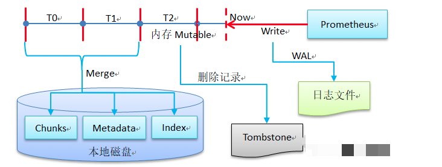

> 参考链接 ：
>
> https://www.modb.pro/db/45956

​      Prometheus是一款开源的监控工具，它的基本实现原理是从exporter拉取数据，或者间接地通过网关gateway拉取数据（如果在k8s内部署，可以使用服务发现的方式），它默认本地存储抓取的所有数据，并通过一定规则进行清理和整理数据，并把得到的结果存储到新的时间序列中，采集到的数据有两个去向，一个是报警，另一个是可视化。以下是Prometheus最新版本的架构图：

Prometheus具有以下特点：

1. 提供多维度数据模型和灵活的查询语言：通过将监控指标关联多个Tag将监控数据进行任意维度的组合；提供HTTP查询接口；可以很方便的结合Grafana等组件展示数据。
2. 支持服务器节点的本地存储：通过prometheus自带的时序数据库，可以完成每秒千万级的数据存储。同时在保存大量历史数据的场景中，prometheus还可以对接第三方时序数据库如OpenTSDB等。
3. 定义了开放指标数据标准：支持pull和push两种方式的数据采集，以基于HTTP的Pull方式采集时序数据，只有实现了prometheus监控数据格式才可以被prometheus采集；以Push方式向中间网关推送时序数据，能更灵活地应对各种监控场景。
4. 支持通过静态文件配置和动态发现机制发现监控对象，自动完成数据采集。prometheus目前已经支持Kubernetes、Consul等多种服务发现机制，可以减少运维人员的手动配置环节。

## 1 组件介绍

从Prometheus的架构图中可以看到，Prometheus主要有四大组件Prometheus Server、Push gateway、Exporters和Alertmanager，分别如下：

1. Prometheus Server：负责从Exporter拉取和存储监控数据，根据告警规则产生告警并发送给Alertmanager，并提供一套灵活的查询语言PromQL
2. Exporters/Jobs：Prometheus的数据采集组件，负责收集目标对象（host, container…）的性能数据，并通过HTTP接口提供给Prometheus Server。支持数据库、硬件、消息中间件、存储系统、http服务器、jmx等。
3. Short-lived jobs：瞬时任务的场景，无法通过pull方式拉取，需要使用push方式，与PushGateway搭配使用
4. PushGateway：应对部分push场景的组件可选组件，这部分监控数据先推送到Push Gateway上，然后再由Prometheus Server端拉取 。用于存在时间较短，可能在Prometheus来拉取之前就消失了的 jobs
5. Alertmanager：从Prometheus server端接收到alerts后，会基于PromQL的告警规则分析数据，如果满足PromQL定义的规则，则会产生一条告警，并发送告警信息到Alertmanager，Alertmanager则是根据配置处理告警信息并发送。常见的接收方式有：电子邮件，pagerduty，OpsGenie, webhook 等。
6. Service Discovery：Prometheus支持多种服务发现机制：文件、DNS、Consul、Kubernetes、OpenStack、EC2等等。基于服务发现的过程是通过第三方提供的接口，Prometheus查询到需要监控的Target列表，然后轮询这些Target获取监控数据。

- Prometheus的工作流程是：

1. Prometheus server定期从配置好的 jobs 或者exporters中拉metrics，或者接收来自Pushgateway发过来的metrics，或者从其他的Prometheus server中拉 metrics；
2. Prometheus server将收集到的metrics数据存储到本地，并运行已定义好的alert.rules，记录新的时间序列或者向Alertmanager推送警报；
3. Alertmanager根据配置文件，对接收到的警报进行处理，发出告警；
4. 对采集的数据进行可视化展示

## 2 存储机制

Prometheus以时间序列的方式将数据存储在本地硬盘，按照两个小时为一个时间窗口，将两小时内产生的数据存储在一个块(Block)中，每一个块又分为多个chunks，其中包含该时间窗口内的所有样本数据(chunks)，元数据文件(meta.json)以及索引文件(index)。

当前时间窗口内正在收集的样本数据会直接保存在内存当中，达到2小时后写入磁盘，这样可以提高Prometheus的查询效率。为了防止程序崩溃导致数据丢失，实现了WAL（write-ahead-log）机制，启动时会以写入日志(WAL)的方式来实现重播，从而恢复数据。此期间如果通过API删除时间序列，删除记录也会保存在单独的逻辑文件当中(tombstone)，而不是立即从chunk文件中删除。

## 3 数据采集方式

Prometheus有两种数据采集方式：pull主动拉取和push被动推送

- pull：指的是客户端先安装各类已有的exporters并以守护进程的模式运行。Explorter采集数据并且可以对http请求作出响应，返回metrics数据。Prometheus通过pull的方式（HTTP_GET）去访问每个节点上的exporter并返回需要的数据。
- push：指的是客户端（或服务端）安装官方的pushgateway插件，然后通过自行编写的脚本，将监控数据组织成metrics的形式发送给pushgateway，而后pushgateway再推送给prometheus，这里需要注意的是pushgateway只是一个中间转发的媒介

Prometheus主要使用Pull的方式，通过HTTP协议去采集数据。总体来说Pull方式比push更好，Pull和Push两种方式对比如下：

| 特点         | Pull                                                         | Push                                         |
| ------------ | ------------------------------------------------------------ | -------------------------------------------- |
| 实时性       | 一定时间间隔拉取数据                                         | 主动推送数据，实时性更好                     |
| 状态保存     | Agent 本身需要一定的数据存储能力                             | 通常采集完成后立即上报，本地不会保存采集数据 |
| 控制能力     | Master 更主动，可以实现集中配置                              | 控制方为 Agent                               |
| 配置的复杂性 | 通常通过批量配置或自动发现来获取所有采集点，可以做到与 Agent 解耦， Agent 不用感知 Master 的存在 | 通常每个 Agent 都需要配置 Master 的地址      |

## 4 Prometheus 中 metrics 类型

Prometheus中主要有以下metrics类型：

- Gauges：仪表盘类型，可增可减，如CPU使用率，内存使用率，集群节点个数，大部分监控数据都是这种类型的
- Counters：计数器类型，只增不减，如机器的启动时间，HTTP访问量等。机器重启不会置零，在使用这种指标类型时，通常会结合rate()方法获取该指标在某个时间段的变化率
- Histograms：柱状图，用于观察结果采样，分组及统计，如：请求持续时间，响应大小。其主要用于表示一段时间内对数据的采样，并能够对其指定区间及总数进行统计。
- Summary：类似Histogram，用于表示一段时间内数据采样结果，其直接存储quantile数据，而不是根据统计区间计算出来的。不需要计算，直接存储结果。

