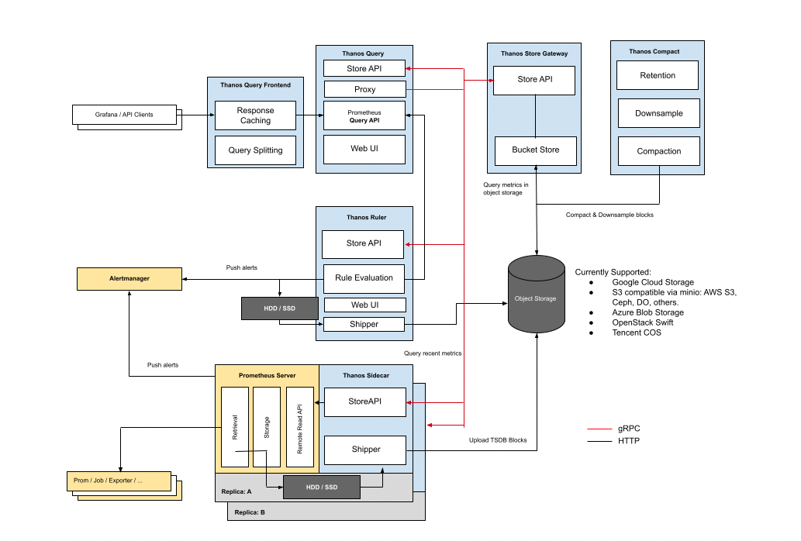
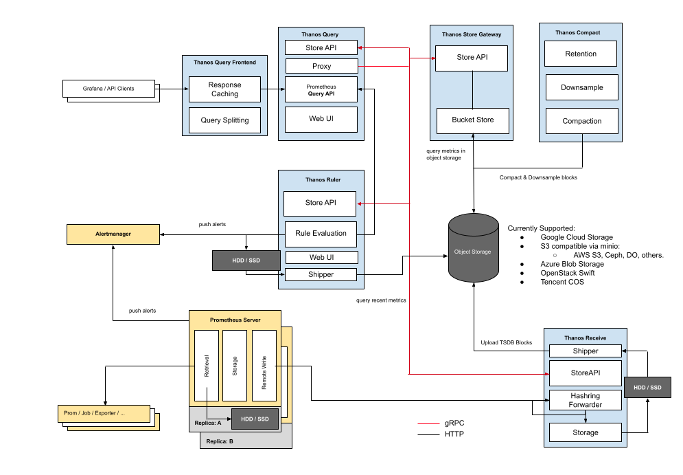
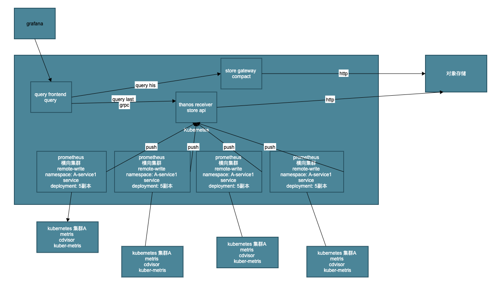

> 参考链接：
>
>  https://dzone.com/articles/high-availability-kubernetes-monitoring-using-prom
>
>  https://blog.csdn.net/u013616005/article/details/107427374
>
>  https://thanos.io/tip/thanos/getting-started.md/

## 1 为什么要用 thanos

Prometheus 是容器监控的标准化解决方案，但是他本身只支持单机部署，也就不支持高可用以及水平扩容。在大规模的数据下，我们可能要做很多的取舍，比如丢弃不重要的指标、降低采集速率、设置较短的数据过期时间(默认只保留15天的数据，看不到比较久远的监控数据)。

### **服务拆分**

Prometheus 主张根据功能或服务维度进行拆分，即如果要采集的服务比较多，一个 Prometheus 实例就配置成仅采集和存储某一个或某一部分服务的指标，这样根据要采集的服务将 Prometheus 拆分成多个实例分别去采集，也能一定程度上达到水平扩容的目的。

### **大规模集群服务分片**

想象一下，如果集群节点数量达到上千甚至几千的规模，对于一些节点级服务暴露的指标，比如 kubelet 内置的 cadvisor 暴露的容器相关的指标，又或者部署的 DeamonSet node-exporter 暴露的节点相关的指标，在集群规模大的情况下，它们这种单个服务背后的指标数据体量就非常大；还有一些用户量超大的业务，单个服务的 pod 副本数就可能过千，这种服务背后的指标数据也非常大，当然这是最罕见的场景，对于绝大多数的人来说这种场景都只敢 YY 一下，实际很少有单个服务就达到这么大规模的业务。

针对上面这些大规模场景，一个 Prometheus 实例可能连这单个服务的采集任务都扛不住。Prometheus 需要向这个服务所有后端实例发请求采集数据，由于后端实例数量规模太大，采集并发量就会很高，一方面对节点的带宽、CPU、磁盘 IO 都有一定的压力，另一方面 Prometheus 使用的磁盘空间有限，采集的数据量过大很容易就将磁盘塞满了，通常要做一些取舍才能将数据量控制在一定范围，但这种取舍也会降低数据完整和精确程度，不推荐这样做。

那么如何优化呢？我们可以给这种大规模类型的服务做一下分片(Sharding)，将其拆分成多个 group，让一个 Prometheus 实例仅采集这个服务背后的某一个 group 的数据，这样就可以将这个大体量服务的监控数据拆分到多个 Prometheus 实例上。

### **拆分引入的新问题**

前面我们通过不通层面对 Prometheus 进行了拆分部署，一方面使得 Prometheus 能够实现水平扩容，另一方面也加剧了监控数据落盘的分散程度，使用 Grafana 查询监控数据时我们也需要添加许多数据源，而且不同数据源之间的数据还不能聚合查询，监控页面也看不到全局的视图，造成查询混乱的局面。

要解决这个问题，我们可以从下面的两方面入手，任选其中一种方案。

### **集中数据存储**

我们可以让 Prometheus 不负责存储，仅采集数据并通过 remote write 方式写入远程存储的 adapter，远程存储使用 OpenTSDB 或 InfluxDB 这些支持集群部署的时序数据库，然后 Grafana 添加我们使用的时序数据库作为数据源来查询监控数据来展示。

### 联邦

简单来说，就是将多个 Prometheus 实例采集的数据再用另一个 Prometheus 采集汇总到一起，这样也意味着需要消耗更多的资源。

通常我们只把需要聚合的数据或者需要在一个地方展示的数据用这种方式采集汇总到一起。比如， Kubernetes 节点数过多，cadvisor 的数据分散在多个 Prometheus 实例上，我们就可以用这种方式将 cadvisor 暴露的容器指标汇总起来，以便于在一个地方就能查询到集群中任意一个容器的监控数据或者某个服务背后所有容器的监控数据的聚合汇总以及配置告警；

又或者多个服务有关联。比如，通常应用只暴露了它应用相关的指标，但它的资源使用情况(比如 cpu 和 内存) 由 cadvisor 来感知和暴露，这两部分指标由不同的 Prometheus 实例所采集，这时我们也可以用这种方式将数据汇总，在一个地方展示和配置告警。

### **高可用**

虽然上面我们通过一些列操作将 Prometheus 进行了分布式改造，但并没有解决 Prometheus 本身的高可用问题，即如果其中一个实例挂了，数据的查询和完整性都将受到影响。

我们可以将所有 Prometheus 实例都使用两个相同副本，分别挂载数据盘，它们都采集相同的服务，所以它们的数据是一致的，查询它们之中任意一个都可以，所以可以在它们前面再挂一层负载均衡，所有查询都经过这个负载均衡分流到其中一台 Prometheus，如果其中一台挂掉就从负载列表里踢掉不再转发。

### why？

thanos 解决以上所有问题

## 2 thanos 架构

### sidecar

### receive

### compoents

#### Sidecar

> 连接 prometheus， 读取数据用来查询或者上传数据到云存储。

Thanos 通过 sidecar 与现有的 Prometheus 服务器集成，该进程与 Prometheus 服务器在同一台机器上或同一 Pod 中运行。

Sidecar 的目的是将 Prometheus 数据备份到对象存储桶中，并让其他 Thanos 组件通过 gRPC API 访问 Prometheus 指标。

#### Thanos Query

>  实现了 Prometheus API，将来自下游组件提供的数据进行聚合最终返回给查询数据的 client (如 grafana)，类似数据库中间件。

#### Thanos Store Gateway

> 将对象存储的数据暴露给 Thanos Query 去查询。

#### Thanos Ruler

> 对监控数据进行评估和告警，还可以计算出新的监控数据，将这些新数据提供给 Thanos Query 查询并且/或者上传到对象存储，以供长期存储。

#### Thanos Compact

> 将对象存储中的数据进行压缩和降低采样率，加速大时间区间监控数据查询的速度。

#### Query Frontend

> 实现 Prometheus 的 v1 API 代理它到查询，同时缓存响应和可选的查询天分割。

#### Receiver

> 从 Prometheus 的远程写入 WAL 接收数据，将其公开和/或上传到云存储。

## 3 思路

