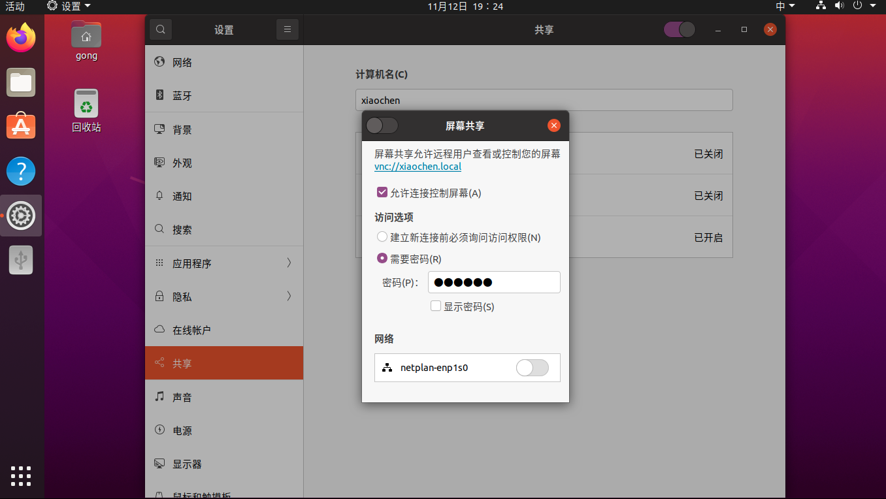

ubutun 自带的屏幕共享需要安装 vino以启用。这种共享方式有一个明显的缺点，他的启动是依赖与用户桌面的。也就是说，即使做了开机自启，依然会启动失败。不过经过探索，可以通过以下配置解决。


## 1 安装 vino vnc

```shell
apt-get install vino
```


## 2 配置屏幕共享

打开 设置(setting)->共享(sharing)->屏幕共享(screen sharing) 设置访问密码。




## 3 配置虚拟屏幕

> 配置虚拟屏幕后 即使设备连接着显示器 也无法登陆。

```shell
sudo vim /etc/X11/xorg.conf

Section "Monitor"
Identifier "Monitor0"
HorizSync 28.0-80.0
VertRefresh 48.0-75.0
# 1024x768 @ 60.00 Hz (GTF) hsync: 47.70 kHz; pclk: 64.11 MHz
# Modeline "1024x768_60.00" 64.11 1024 1080 1184 1344 768 769 772 795 -HSync +Vsync
# 1280x720 @ 60.00 Hz (GTF) hsync: 44.76 kHz; pclk: 74.48 MHz
# Modeline "1280x720_60.00" 74.48 1280 1336 1472 1664 720 721 724 746 -HSync +Vsync
# 1368x768 @ 60.00 Hz (GTF) hsync: 47.70 kHz; pclk: 85.86 MHz
# Modeline "1368x768_60.00" 85.86 1368 1440 1584 1800 768 769 772 795 -HSync +Vsync
# 1600x900 @ 60.00 Hz (GTF) hsync: 55.92 kHz; pclk: 119.00 MHz
# Modeline "1600x900_60.00" 119.00 1600 1696 1864 2128 900 901 904 932 -HSync +Vsync
# 1920x1080 @ 60.00 Hz (GTF) hsync: 67.08 kHz; pclk: 172.80 MHz
Modeline "1920x1080_60.00" 172.80 1920 2040 2248 2576 1080 1081 1084 1118 -HSync +Vsync
EndSection

Section "Device"
Identifier "Card0"
Option "NoDDC" "true"
Option "IgnoreEDID" "true"
Driver "dummy"
EndSection

Section "Screen"
DefaultDepth 24
Identifier "Screen0"
Device "Card0"
Monitor "Monitor0"
    SubSection "Display"
    Depth 24
    Modes "1920x1080"
    EndSubSection
EndSection
```


## 4 配置用户自动登录

> 之所以要配置用户自动登录， 是因为 ubuntu 只有用户登录之后才会打开远程桌面

```shell
# 注意 username 配置成远程登录用户名（不可为 root） ，如之前没配置过，直接覆盖即可（记得备份）
sudo vim /etc/gdm3/custom.conf

[daemon]
AutomaticLoginEnable = true
AutomaticLogin = username
[security]
[xdmcp]
[chooser]
[debug]
```


## 5 配置 vino vnc 开机自启

```shell
# 注意 username 配置成远程登录用户名（不可为 root）
sudo vim /etc/systemd/system/vncserver.service

[Unit]
Description= ubuntu  vino vnserver

[Service]
Type=simple
User=username
Environment="DISPLAY=:0.0"
ExecStart=/usr/lib/vino/vino-server

[Install]
WantedBy=graphical.target
```

开机自启

```shell
systemctl start vncserver
```

至此 vnc server 已经配置完毕

