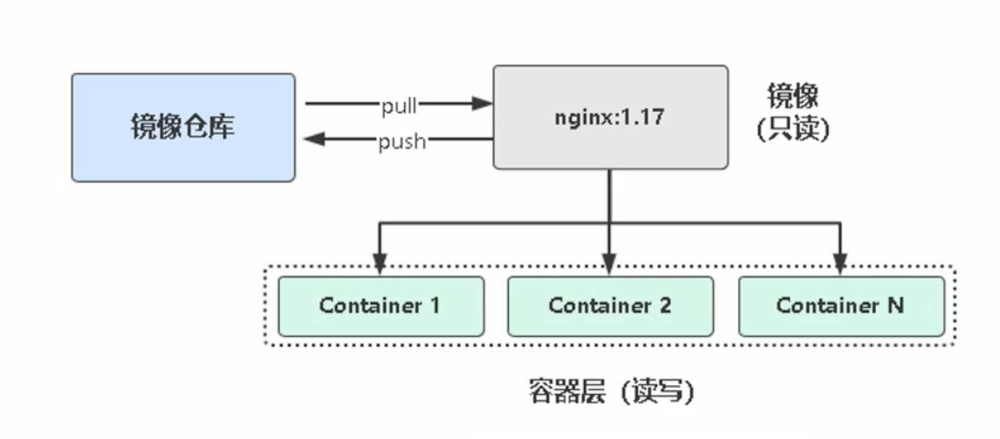
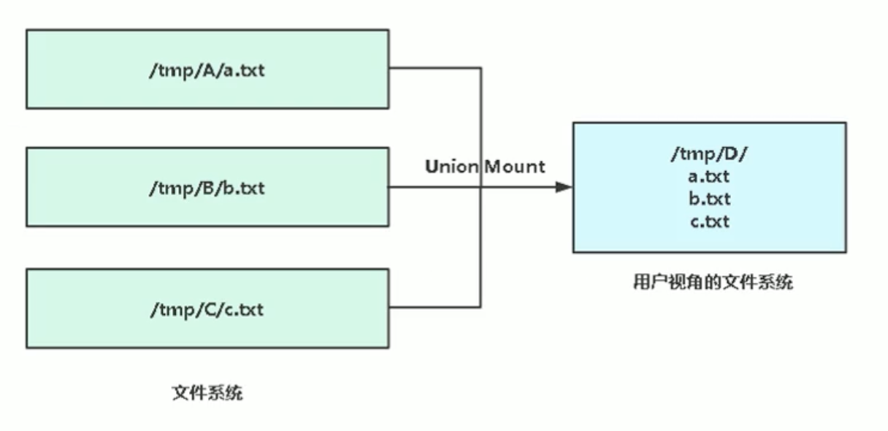
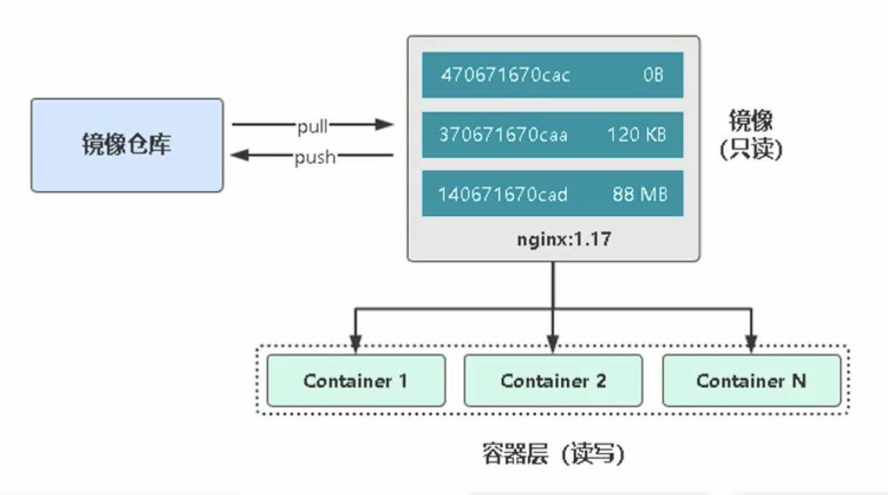
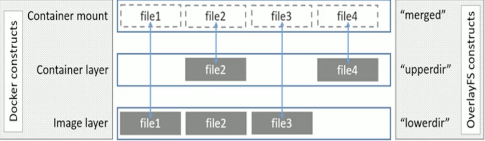

# 一、 镜像是什么

- 一个分层存储的文件，不是一个单一的文件
- 一个软件的环境
- 一个镜像可以创建 N 个容器
- 一种标准化的交付
- 不包含 Linux 内核而又精简的 Linux 操作系统

# 二、 镜像和容器的关系

**镜像：** 类似于虚拟精镜像，一个只读的模版。   默认路径： /var/lib/docker/overlay2

**容器：** 通过镜像创建的运行实例。 默认路径：/var/lib/docker/containers




# 三、 管理镜像常用的指令

| 指令    | 描述                                      |
| ------- | ----------------------------------------- |
| ls      | 列出镜像                                  |
| build   | 构建镜像来自 Dockerfile                   |
| history | 查看镜像历史                              |
| inspect | 显示一个或多个镜像(容器)详细信息          |
| pull    | 从镜像仓库拉取镜像                        |
| push    | 推送一个镜像到镜像仓库                    |
| rm      | 移除一个或多个镜像                        |
| prune   | 移除没有被标记或者没有任何容器引用的镜像  |
| tag     | 创建一个引用源镜像标记目标镜像            |
| export  | 导出容器文件系统到 tar 归档文件           |
| import  | 导入容器文件系统 tar 归档文件 创建镜像    |
| save    | 保存一个活动个镜像文件到一个 tar 归档文件 |
| load    | 加载镜像来自 tar 归档或标准输入           |

```shell
# 修改镜像标签
docker tag hello-world:latest hello-world:1


# 从容器到处 从镜像导入
docker export dc5 > nginx.tar
[root@server-one study]# ls
nginx.tar
[root@server-one study]# docker import nginx.tar nginx:123
sha256:e29639c6738328addbe4957f554883e8da8dc50afda5797992cfcd36a7ee45f9
[root@server-one study]# docker images
REPOSITORY    TAG       IMAGE ID       CREATED          SIZE
nginx         123       e29639c67383   1 second ago     132MB


# 从镜像导出 从镜像导入
# 使用场景： 本地没有配置 docker 库 有一台机器无法连接外网 但是需要下载镜像

[root@server-one study]# docker save nginx:123 > nginx123.tar
[root@server-one study]# ls
nginx123.tar  nginx.tar
[root@server-one study]# docker images
REPOSITORY    TAG       IMAGE ID       CREATED         SIZE
nginx         123       e29639c67383   4 minutes ago   132MB
nginx         latest    08b152afcfae   11 days ago     133MB
hello-world   1         d1165f221234   5 months ago    13.3kB
hello-world   latest    d1165f221234   5 months ago    13.3kB
centos        latest    300e315adb2f   7 months ago    209MB
nginx         1.16      dfcfd8e9a5d3   15 months ago   127MB
[root@server-one study]# docker image rm e29
Untagged: nginx:123
Deleted: sha256:e29639c6738328addbe4957f554883e8da8dc50afda5797992cfcd36a7ee45f9
Deleted: sha256:802db03d8d5ea004db94940d9b5450da72ab09e42e41e3497e4c10b09c166bbc
[root@server-one study]# docker load  < nginx123.tar
802db03d8d5e: Loading layer  135.7MB/135.7MB
Loaded image: nginx:123
[root@server-one study]# docker images
REPOSITORY    TAG       IMAGE ID       CREATED         SIZE
nginx         123       e29639c67383   4 minutes ago   132MB
nginx         latest    08b152afcfae   11 days ago     133MB
hello-world   1         d1165f221234   5 months ago    13.3kB
hello-world   latest    d1165f221234   5 months ago    13.3kB
centos        latest    300e315adb2f   7 months ago    209MB
nginx         1.16      dfcfd8e9a5d3   15 months ago   127MB
```

# 四、 镜像存储核心技术

## （1）联合文件系统（UnionFS）

Q：镜像怎么高效存储？

A：引入联合文件系统，将景象多层问价年联合挂载到容器文件系统。





## （2）写时复制（COW）

Q：了解了联合文件系统后，我们知道，镜像是只读的，类似共享形式让多个容器使用，如果在容器里修改文件，即镜像里的文件，那该怎么办呢？

A：引入写时复制（copy-on-write），需要修改文件操作时，会先让镜像里把要写的文件复制到自己的文件系统中进行修改。



读文件：容器层 -> 镜像层

写文件：复制到容器层 -> 修改

性能优化：

- /var/lib/docker 挂载 SSD 硬盘。
- 使用卷作为频繁读写文件的工作陌路，绕过存储驱动，减少抽象的开销。