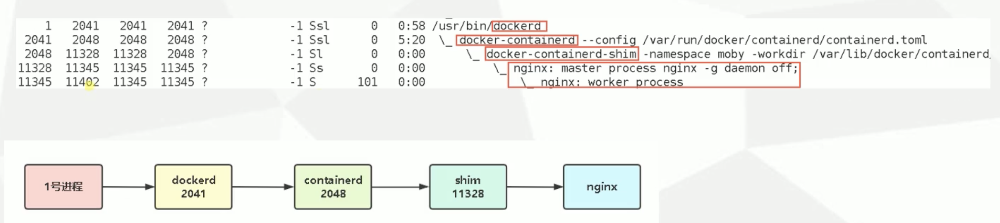

# 一、创建容器常用选项

| 选项              | 描述                                                         |
| ----------------- | ------------------------------------------------------------ |
| -i,-interactive   | 交互式                                                       |
| -t,-tty           | 分配一个伪终端                                               |
| -d,-detach        | 运行容器到后台                                               |
| -e,-env           | 设置环境变量                                                 |
| -p,--publish list | 发布容器端口到主机                                           |
| -P,--publish-all  | 发布容器所有EXPOSE的端口到宿主机随机端口                     |
| --name string     | 指定容器名称                                                 |
| -h,--hostname     | 设计容器主机名                                               |
| -ip string        | 指定容器IP， 只能用于自定义网络                              |
| --network         | 连接容器到一个网络                                           |
| --mount           | 将文件系统附加到容器                                         |
| -v,--volume list  | 绑定挂载一个卷                                               |
| --restart staring | 容器退出时重启策略，默认 no 可选值：[ always \| on-failure ] |

```shell
# centos 默认基础镜像没有任何进程需要
docker run -itd centos
# 直接 -d 没有进程 hand 住 容器，会显示容器为退出状态
docker run -d centos
# 通过 docker top 查看容器里的进程

[root@server-one ~]# docker run -itd centos
cbccf583ee46ddb2d7151ec2e5d9e32d3a9c750732397e99e807d668d5222904
[root@server-one ~]# docker top cbcc
UID                 PID                 PPID                C                   STIME               TTY                 TIME                CMD
root                19022               19003               0                   15:35               pts/0               00:00:00            /bin/bash
[root@server-one ~]# docker run -d centos
dfe90427ecb01feb89f0f2f8590fd9572cdf4ba12669f363b952b47c6845be03
[root@server-one ~]# docker top dfe
Error response from daemon: Container dfe90427ecb01feb89f0f2f8590fd9572cdf4ba12669f363b952b47c6845be03 is not running

# 环境变量
[root@server-one ~]# docker run -d -e ABC=123 -e CDE=456 nginx:1.16
228c266c7756a55d1d9c66be721219a4c21533ef348714e494c77f2112546f59
[root@server-one ~]# docker exec -it 22 bash
root@228c266c7756:/# echo $ABC
123

# 端口
docker run -d -p 8888:80 nginx:1.16

# 容器名
docker run -d --name nginx nginx:1.16

# 主机名
[root@server-one ~]# docker run -d -h gongbosheng nginx:1.16
22d226d5dca55c0441b46d33fdd97752bc5e5baf8b270dab1c5178c96b6397ca
[root@server-one ~]# docker exec -it 22d bash
root@gongbosheng:/# exit
exit

# 设置容器开机启动(docker重启容器自动启动)
[root@server-one ~]# docker run -d --name restart --restart=always nginx:1.16
af3d7866e1446e07e31df513ec73c80297696449492a112e772d56c88b0217d4
[root@server-one ~]# docker ps | grep af3
af3d7866e144   nginx:1.16   "nginx -g 'daemon of…"   10 seconds ago   Up 9 seconds   80/tcp                                  restart
[root@server-one ~]# systemctl restart docker
[root@server-one ~]# docker ps
CONTAINER ID   IMAGE        COMMAND                  CREATED          STATUS         PORTS     NAMES
af3d7866e144   nginx:1.16   "nginx -g 'daemon of…"   35 seconds ago   Up 6 seconds   80/tcp    restart

```

# 二、容器资源限制

默认创建的容器使用宿主机的所有资源

| 选项                        | 描述                                               |
| --------------------------- | -------------------------------------------------- |
| -m                          | 容器可以使用的最大内存量                           |
| --memory-swap               | 允许交换到磁盘的内存量                             |
| --memory-swappiness=<0-100> | 容器使用 SWAP 分区交换的百分比（0-100，默认为 -1） |
| --oom-kill-disable          | 禁用 OOM Killer                                    |
| --cpus                      | 可以使用的CPU 数量                                 |
| --cpuset-cpus               | 限制容器使用特定的 CPU 核心，如（0-3，0，1）       |
| --cpu-shares                | CPU 共享（相对权重）                               |


```shell
# 创建容器限制内存
[root@server-one ~]# docker run -d -m="512M" nginx:1.16
96c5063e07c4c5f7e11dd347efc3c7a843b4f51bb8eed05b2bcf95470e90f3a5

# 查看资源使用/限制情况
docker stats

# 禁用 oom
# oom killer 为当宿主机内存不足时，会找到一个消耗资源比较大的进程 kill 掉 
docker run -d --oom-kill-disable nginx:1.16

# 限制容器使用 CPU 的核心数
docker run -d --cpus="1.5" nginx
```

# 三、容器资源配额扩容

```shell
docker update -m="111M" a4c
docker update --help
```


# 四、管理容器常用命令

| 选项               | 描述                         |
| ------------------ | ---------------------------- |
| ls                 | 列出容器                     |
| inspect            | 查看一个或多个容器详细信息   |
| exec               | 在运行容器中执行命令         |
| commit             | 创建一个新镜像来自一个容器   |
| cp                 | 拷贝文件/文件夹到一个容器    |
| logs               | 获取一个容器的日志           |
| port               | 列出指定容器端口映射         |
| top                | 显示一个容器运行的进程       |
| stats              | 显示容器资源使用统计         |
| stop/start/restart | 停止/启动/重启一个或多个容器 |
| rm                 | 删除一个或多个容器           |
| prune              | 移除已经停止的容器           |

```shell
# 列出运行
docker container ls
docker ps
# 列出所有
docker container ls -a
docker ps -a


# 移除停止容器
docker container prune

# 查看容器详细信息
docker inspect a4c

# 进入容器
docker exec -it a4c bash

# 获取容器资源信息
docker stats a4c

# 获取容器日志
docker logs a4c

# 显示容器运行的进程
docker top a4c

# 重启正在运行的容器
[root@server-one study]# docker restart $(docker ps -aq)
a4c8f6f4920d
dc5da82725c5
27bb2be31d88
91fcf61d09d5
96c5063e07c4
[root@server-one study]# docker container ls
CONTAINER ID   IMAGE        COMMAND                  CREATED             STATUS          PORTS     NAMES
a4c8f6f4920d   nginx        "/docker-entrypoint.…"   11 minutes ago      Up 12 seconds   80/tcp    serene_ganguly
dc5da82725c5   nginx        "/docker-entrypoint.…"   52 minutes ago      Up 11 seconds   80/tcp    jolly_kapitsa
27bb2be31d88   nginx:1.16   "nginx -g 'daemon of…"   56 minutes ago      Up 11 seconds   80/tcp    unruffled_moser
91fcf61d09d5   nginx:1.16   "nginx -g 'daemon of…"   About an hour ago   Up 11 seconds   80/tcp    heuristic_robinson
96c5063e07c4   nginx:1.16   "nginx -g 'daemon of…"   About an hour ago   Up 10 seconds   80/tcp    romantic_yonath

# 从容器创建镜像
[root@server-one study]# docker commit a4c nginx:test
sha256:fcf6d4414fc30a262137bae3439e656265eedbda8c62a00b5aab3d662f3998a2
[root@server-one study]# docker images
REPOSITORY    TAG       IMAGE ID       CREATED          SIZE
nginx         test      fcf6d4414fc3   5 seconds ago    133MB


# 复制文件
[root@server-one study]# docker cp web:/123 ./
[root@server-one study]# ls
123

[root@server-one study]# docker cp ./456 web:/456
[root@server-one study]# docker exec web ls
123  boot		  docker-entrypoint.sh	lib    mnt   root  srv	usr
456  dev		  etc			lib64  opt   run   sys	var


# 查看端口映射关系
[root@server-one study]# docker port haha1
80/tcp -> 0.0.0.0:888
80/tcp -> :::888
```


# 五、容器实现核心技术

## （1）Namespace

在容器化中，一台物理计算机可以运行多个不同的操作系统，那就需要解决隔离性， 彼此感知不到对方的存在，有问题不影响。

Linux 内核从 2.4.19 版本开始引入了 namespace 概念，其目的是将特定的全局系统资源通过抽象方法使得 namespace 中的进程看起来拥有自己的隔离资源。 Docker 就是借助这个机制实现了容器资源隔离。

Linux 的 Namespace 机制中提供了 6 种不同命名空间。

- IPC ： 隔离进程间通信
- MOUNT： 隔离系统文件挂载点
- NET： 隔离网络协议栈
- PID： 隔离进程号，进程命名空间是一个父子结构，子空间对父空间可见
- USER：隔离用户
- UTS：隔离主机名和域名

```shell
[root@server-one study]# ls /proc/$$/ns
ipc  mnt  net  pid  user  uts
```


## （2）CGroups

Docker 利用 namespace 实现了容器之间资源的隔离，但是 namespace 不能对容器资源限制，比如 CPU、 内存。 如果某一个容器属于 CPU 密集型任务，那么会影响其他容器使用 CPU， 导致多个容器相互影响并且抢占资源。 于是 Docker 引入了 Control Groups 限制容器资源。

**CGroups ：**   所有的任务就是运行在系统中的一个进程，而 CGroups 以某种标准将一组进程为目标进行资源分配和控制。例如 CPU、内存、带宽等，并且可以动态配置。

**CGroups 主要功能：**

- 限制进程组使用资源数量（Resource limitation）： 可以为进程组设定资源使用上线，例如内存。
- 进程组优先级控制（Priorirization）： 可以为进程组分配特定 CPU、 磁盘 IO 吞吐量。
- 记录进程组使用的资源数量（Accounting）： 例如记录某个进程组使用的 CPU 的时间。
- 进程组控制（Control）： 可以将进程组挂起和恢复。

**Cgroup 可以控制的资源：**

```shell
ls /sys/fs/cgroup -l # 查看 cgroups 可控制的资源。
```

- blkio：对块设备 IO 进行限制。
- cpu：限制 CPU 时间片的分配， 与 cpuacct 挂载同一目录。
- cpuacct：生成 cgroup 中的任务咋用 CPU 资源的报告， 与 cpu 挂载同一目录。
- cpuset： 给 cgroup 中的任务分配独立的 CPU （多核处理器）和内存节点
- devices：允许或者拒绝 cgroup 中的任务访问设备
- freezer：暂停/恢复 cgroup 中的任务
- hugetlb： 限制使用的内存页数量
- memory：对 cgroup 中任务的可用内存进行限制，并自动生成资源占用报告。
- net_cls：对等级识别符（classid） 标记网络数据包，这让 Linux 流量控制程序 （tc） 可以识别来自特定从 cgroup 任务的数据包，并进行网络限制。
- net_prio：允许基于 cgroup 设置网络流量的优先级
- perf_event：允许使用 perf 控制来监控 cgroup
- pids：限制任务的数量

**容器实际资源限制位置：**

```shell
/sys/fs/cgroup/<资源名>/docker/<容器ID>
```


# 六、Docker 核心组件之间关系

**Docker Daemon ：**   docker 守护进程， 负责和 Docker Client 交互，并管理镜像，容器。

**Conrainerd：**  是一个简单的守护进程，向上给 Docker Daemon 提供接口， 向下通过  contanerd-shim 结合 runC 管理容器。

**runC：**  一个命令行工具，他根据 OCI 标准来创建和运行容器。


