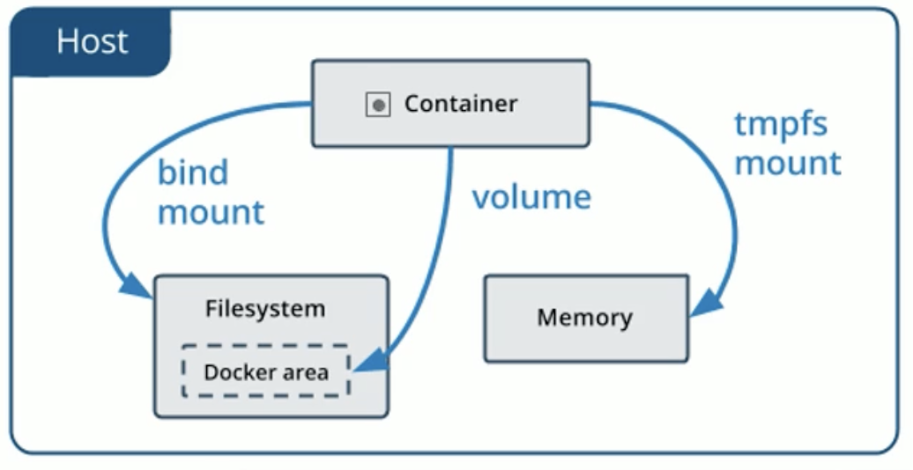

# 一、 Volume

Docker 管理宿主机文件系统的一部分（/var/lib/docker/volumes）保存数据的最佳方式。容器和卷相互独立。

```shell
# 创建查看数据卷
[root@server-one /]# docker volume create nginx-col
nginx-col
[root@server-one /]# docker volume ls
DRIVER    VOLUME NAME
local     nginx-col

# 创建容器使用数据卷
docker run -d --name=nginx1 --mount src=nginx-vol,dst=/usr/share/nginx/html nginx
docker run -d --name=nginx2 -v nginx-vol:/usr/share/nginx/html nginx

# 查看卷的信息
docker volume inspect nginx-vol
[
    {
        "CreatedAt": "2021-08-04T14:42:39+08:00",
        "Driver": "local",
        "Labels": null,
        "Mountpoint": "/var/lib/docker/volumes/nginx-vol/_data",
        "Name": "nginx-vol",
        "Options": null,
        "Scope": "local"
    }
]

# 删除卷
 docker volume rm nginx-col
 
# 不提前创建卷，但是创建容器时使用，会自动创建卷。

# 卷与容器独立。
```


# 二、 Bind Mount

将宿主机上的任意位置的文件或者目录挂载到容器中。

```shell
docker run -d --name=nginx1 --mount type=bind,source=/study,target=/usr/share/nginx/html nginx
docker run -d --name=nginx2 -v /study:/usr/share/nginx/html nginx

# 此种方法会第一次挂载会把容器里被挂载的目录直接覆盖
```


# 三、 tmpfs

挂载存储在宿主机系统的内存中，而不会写入主机的文件系统，如果不希望将数据持久存储在任何位置，可以使用 tmpfs，同时避免写入容器可写层，提高性能。