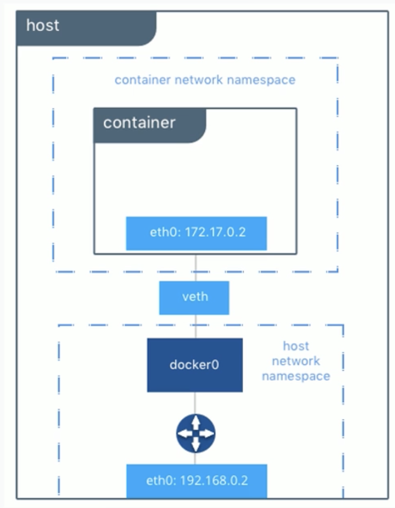
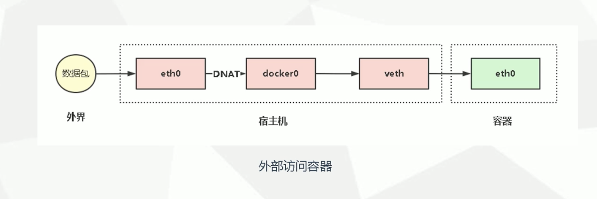
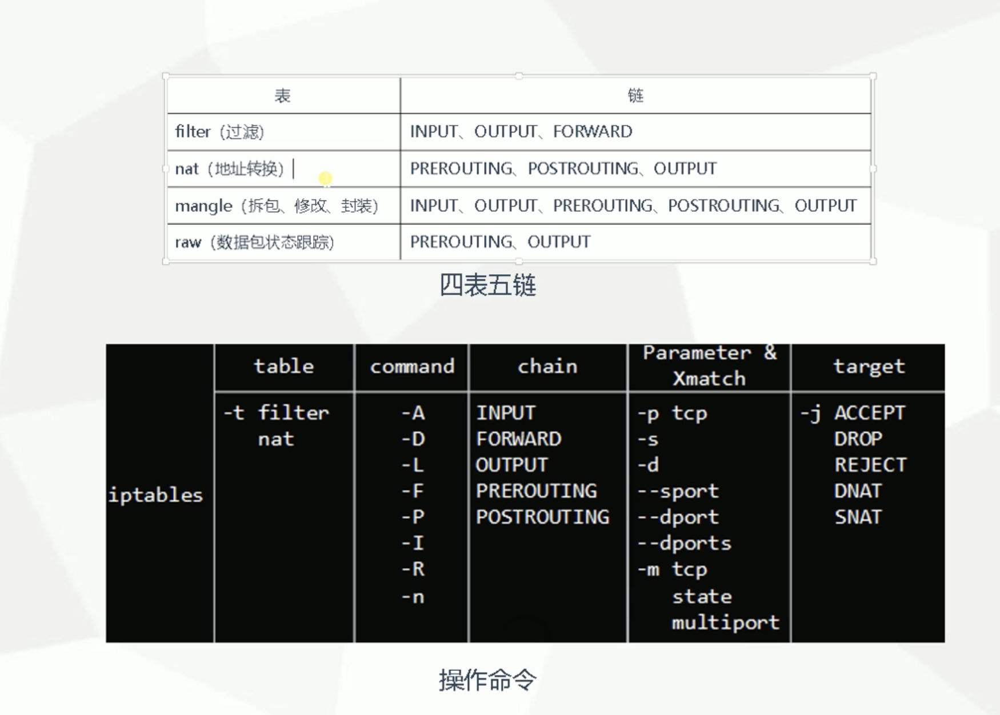
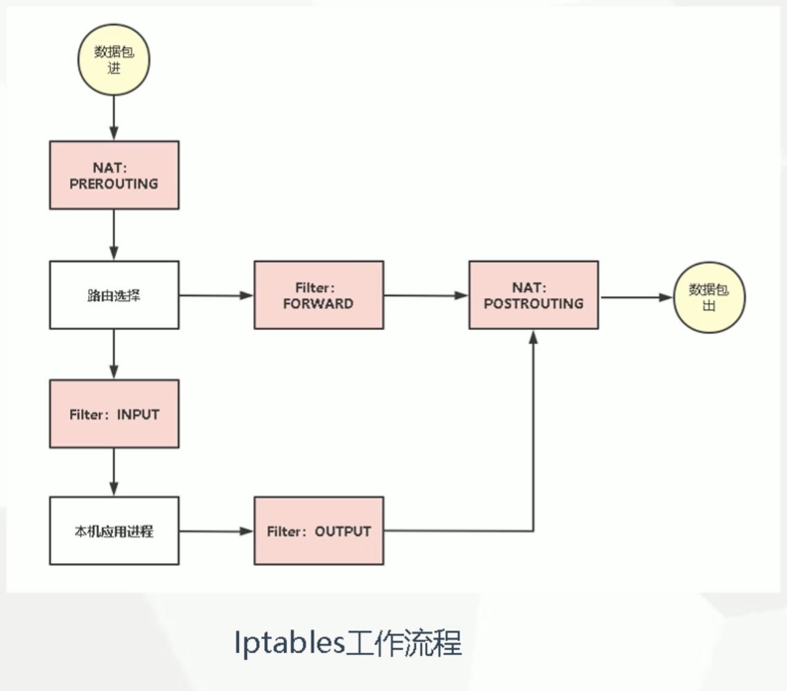
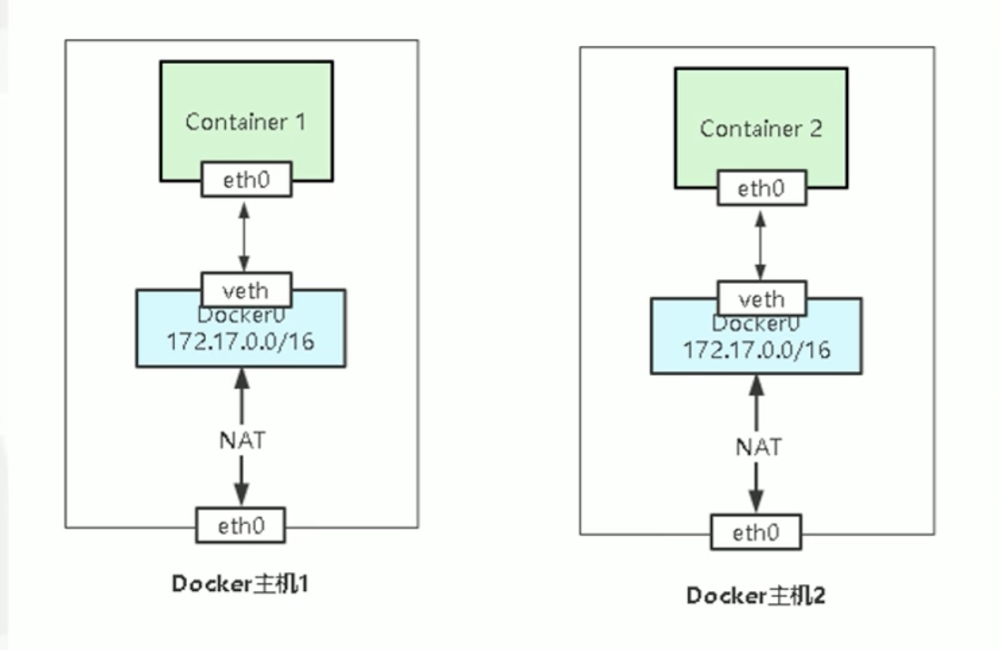
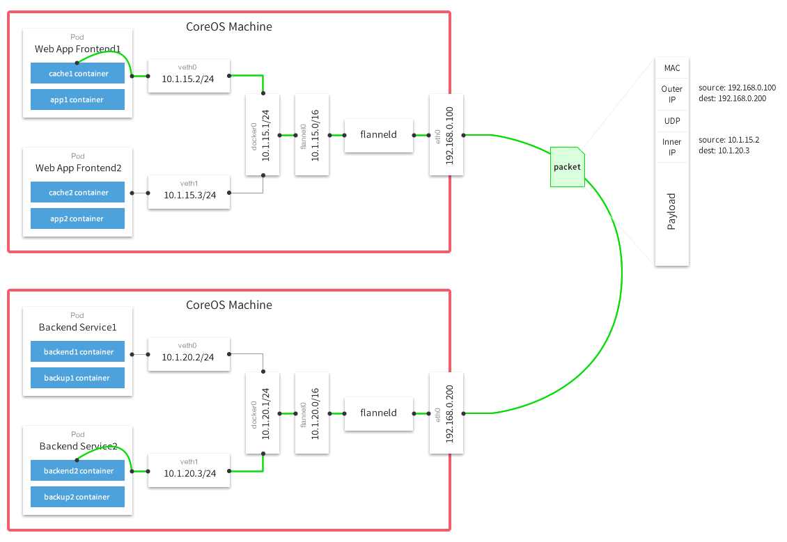

# 一、 四种网络模式


## （1）bridge

```shell
-net=bridge
```

默认网络， Docker 启动后创建一个 docker0 网桥，默认创建的容器也是添加到这个网桥中。

也可以自定义网络，相比默认的，具备内部 DNS 发现，可以通过容器名进行容器之间网络通信。

> 使用场景为，当数据库 done 掉 需要重新启动， 这时 ip 可能变了 但是名字是不变的。可以通过指定名字进行通信。

```shell
docker network --help

Usage:  docker network COMMAND

Manage networks

Commands:
  connect     Connect a container to a network
  create      Create a network
  disconnect  Disconnect a container from a network
  inspect     Display detailed information on one or more networks
  ls          List networks
  prune       Remove all unused networks
  rm          Remove one or more networks
  
  

# 列出当前网络模式
docekr network ls

# 查看网络模式详细信息 （ip池等）
docker network inspect bridge

# 安装查看网桥指令
yum install -y bridge-utils

# 查看网桥信息
[root@server-one nginx-col]# docker run -d nginx
c930c58636d591354c3562fc57535fd5a240ee87884237bdf7daae7126b9f622
[root@server-one nginx-col]# brctl show docker0
bridge name	bridge id		STP enabled	interfaces
docker0		8000.0242a7954a53	no		veth2a31698

# 创建自定义网桥
[root@server-one nginx-col]# docker network create test
e47418c9386eaf7bb05f96d950216ddb6cd77e119fbadddcf7b929b7a9279f72
[root@server-one nginx-col]# docker network ls
NETWORK ID     NAME      DRIVER    SCOPE
eafea7cf9dc9   bridge    bridge    local
9591bb320973   host      host      local
4a649d56570f   none      null      local
e47418c9386e   test      bridge    local

# 创建完成后会出现一个随机名字的 docker 网桥
[root@server-one nginx-col]# ifconfig
br-e47418c9386e: flags=4099<UP,BROADCAST,MULTICAST>  mtu 1500
        inet 172.18.0.1  netmask 255.255.0.0  broadcast 172.18.255.255
        ether 02:42:df:3c:02:f7  txqueuelen 0  (Ethernet)
        RX packets 0  bytes 0 (0.0 B)
        RX errors 0  dropped 0  overruns 0  frame 0
        TX packets 8  bytes 656 (656.0 B)
        TX errors 0  dropped 0 overruns 0  carrier 0  collisions 0

docker0: flags=4163<UP,BROADCAST,RUNNING,MULTICAST>  mtu 1500
        inet 172.17.0.1  netmask 255.255.0.0  broadcast 0.0.0.0
        inet6 fe80::42:a7ff:fe95:4a53  prefixlen 64  scopeid 0x20<link>
        ether 02:42:a7:95:4a:53  txqueuelen 0  (Ethernet)
        RX packets 21  bytes 2864 (2.7 KiB)
        RX errors 0  dropped 0  overruns 0  frame 0
        TX packets 31  bytes 2951 (2.8 KiB)
        TX errors 0  dropped 0 overruns 0  carrier 0  collisions 0
        
# 为创建的容器指定自定义网桥
docker run -d --net test nginx
# 这是查询已经可以看到刚才创建的随机网桥的网段啦
docker inspect a6
# 通过刚才创建的网桥的随机的网卡的名字的查看网桥使用信息
[root@server-one nginx-col]# brctl show br-e47418c9386e
bridge name	bridge id		STP enabled	interfaces
br-e47418c9386e		8000.0242df3c02f7	no		vethbe94585


# 自定义网桥使用名字进行通信实例
[root@server-one nginx-col]# docker run -itd --name aaa --net test centos bash
3806b7c953f45103ab51ee5ccb4dc40ace2c290bfd25ccfc73733cd008c0d220
[root@server-one nginx-col]# docker ps -a
CONTAINER ID   IMAGE     COMMAND   CREATED         STATUS         PORTS     NAMES
3806b7c953f4   centos    "bash"    4 seconds ago   Up 3 seconds             aaa
[root@server-one nginx-col]# docker run -itd --name bbb --net test centos
98b6cd3c906035ac671ef8eb3ad37d89781857e17d1e597b82547775c433561f
[root@server-one nginx-col]# docker exec -it aaa bash
[root@3806b7c953f4 /]# ping bbb
PING bbb (172.18.0.3) 56(84) bytes of data.
64 bytes from bbb.test (172.18.0.3): icmp_seq=1 ttl=64 time=0.053 ms
64 bytes from bbb.test (172.18.0.3): icmp_seq=2 ttl=64 time=0.132 ms
^C
--- bbb ping statistics ---
2 packets transmitted, 2 received, 0% packet loss, time 2ms
rtt min/avg/max/mdev = 0.053/0.092/0.132/0.040 ms
```


## （2）host

```shell
--net=host
```

容器不会获得一个独立的 network namespace， 而是与宿主机共用一个。 这就意味着容器不会有自己的网卡信息， 而是使用宿主机的。 容器除了网络，其他都是隔离的。

```shell
[root@server-one nginx-col]# docker run -it --net=host busybox sh
Unable to find image 'busybox:latest' locally
latest: Pulling from library/busybox
b71f96345d44: Pull complete
Digest: sha256:0f354ec1728d9ff32edcd7d1b8bbdfc798277ad36120dc3dc683be44524c8b60
Status: Downloaded newer image for busybox:latest
/ # ifconfig
br-e47418c9386e Link encap:Ethernet  HWaddr 02:42:DF:3C:02:F7
          inet addr:172.18.0.1  Bcast:172.18.255.255  Mask:255.255.0.0
          inet6 addr: fe80::42:dfff:fe3c:2f7/64 Scope:Link
          UP BROADCAST RUNNING MULTICAST  MTU:1500  Metric:1
          RX packets:1 errors:0 dropped:0 overruns:0 frame:0
          TX packets:5 errors:0 dropped:0 overruns:0 carrier:0
          collisions:0 txqueuelen:0
          RX bytes:28 (28.0 B)  TX bytes:446 (446.0 B)

docker0   Link encap:Ethernet  HWaddr 02:42:A7:95:4A:53
          inet addr:172.17.0.1  Bcast:0.0.0.0  Mask:255.255.0.0
          inet6 addr: fe80::42:a7ff:fe95:4a53/64 Scope:Link
          UP BROADCAST MULTICAST  MTU:1500  Metric:1
          RX packets:21 errors:0 dropped:0 overruns:0 frame:0
          TX packets:31 errors:0 dropped:0 overruns:0 carrier:0
          collisions:0 txqueuelen:0
          RX bytes:2864 (2.7 KiB)  TX bytes:2951 (2.8 KiB)

ens33     Link encap:Ethernet  HWaddr 00:0C:29:26:6D:79
          inet addr:10.0.34.129  Bcast:10.0.34.255  Mask:255.255.255.0
          UP BROADCAST RUNNING MULTICAST  MTU:1500  Metric:1
          RX packets:3127877 errors:0 dropped:347349 overruns:0 frame:0
          TX packets:256802 errors:0 dropped:0 overruns:0 carrier:0
          collisions:0 txqueuelen:1000
          RX bytes:729714994 (695.9 MiB)  TX bytes:23407021 (22.3 MiB)

lo        Link encap:Local Loopback
          inet addr:127.0.0.1  Mask:255.0.0.0
          inet6 addr: ::1/128 Scope:Host
          UP LOOPBACK RUNNING  MTU:65536  Metric:1
          RX packets:86 errors:0 dropped:0 overruns:0 frame:0
          TX packets:86 errors:0 dropped:0 overruns:0 carrier:0
          collisions:0 txqueuelen:1000
          RX bytes:6912 (6.7 KiB)  TX bytes:6912 (6.7 KiB)

veth496b383 Link encap:Ethernet  HWaddr 5E:C6:61:22:61:BB
          inet6 addr: fe80::5cc6:61ff:fe22:61bb/64 Scope:Link
          UP BROADCAST RUNNING MULTICAST  MTU:1500  Metric:1
          RX packets:13 errors:0 dropped:0 overruns:0 frame:0
          TX packets:21 errors:0 dropped:0 overruns:0 carrier:0
          collisions:0 txqueuelen:0
          RX bytes:1050 (1.0 KiB)  TX bytes:1706 (1.6 KiB)

veth7b98dda Link encap:Ethernet  HWaddr AE:F4:CC:59:B6:E1
          inet6 addr: fe80::acf4:ccff:fe59:b6e1/64 Scope:Link
          UP BROADCAST RUNNING MULTICAST  MTU:1500  Metric:1
          RX packets:13 errors:0 dropped:0 overruns:0 frame:0
          TX packets:21 errors:0 dropped:0 overruns:0 carrier:0
          collisions:0 txqueuelen:0
          RX bytes:1050 (1.0 KiB)  TX bytes:1706 (1.6 KiB)
```


## （3）none

```shell
--net=none
```

获得独立 network namespace ，但不为容器进行任何网络配置，需要我们手动配置。

```shell
[root@server-one nginx-col]# docker run -it --net=none busybox sh
/ # ifconfig
lo        Link encap:Local Loopback
          inet addr:127.0.0.1  Mask:255.0.0.0
          UP LOOPBACK RUNNING  MTU:65536  Metric:1
          RX packets:0 errors:0 dropped:0 overruns:0 frame:0
          TX packets:0 errors:0 dropped:0 overruns:0 carrier:0
          collisions:0 txqueuelen:1000
          RX bytes:0 (0.0 B)  TX bytes:0 (0.0 B)
```


## （4）container

```shell
--net=container:Name/ID
```

与指定的容器使用同一个 network namespace ， 具有同样的网络配置信息，两个容器除了网络， 其他都是隔离的。

端口冲突 如两台 nginx 共用一个namespace 会导致后面的 nginx 无法启动。

```shell
[root@server-one nginx-col]# docker run -d --name=web1 nginx
[root@server-one nginx-col]# docker run -itd --name=c1 --net=container:web1 centos
[root@server-one nginx-col]# docker container inspect web1 | grep IPAddress | tail -1
                    "IPAddress": "172.17.0.2",
[root@server-one nginx-col]# docker exec -it c1 bash
[root@ae4aef532272 /]# ip a
1: lo: <LOOPBACK,UP,LOWER_UP> mtu 65536 qdisc noqueue state UNKNOWN group default qlen 1000
    link/loopback 00:00:00:00:00:00 brd 00:00:00:00:00:00
    inet 127.0.0.1/8 scope host lo
       valid_lft forever preferred_lft forever
97: eth0@if98: <BROADCAST,MULTICAST,UP,LOWER_UP> mtu 1500 qdisc noqueue state UP group default
    link/ether 02:42:ac:11:00:02 brd ff:ff:ff:ff:ff:ff link-netnsid 0
    inet 172.17.0.2/16 brd 172.17.255.255 scope global eth0
       valid_lft forever preferred_lft forever
```


# 二、 Docker 网络模型

**veth pair ：**   成对出现的一种虚拟网络设备，数据从一端进入，从另外一端出。用于解决网络命名空间之间隔离。（每创建一个 bridge 网络容器创建对 veth（eth0 veth））连接 eth0 与 docker0。

- 容器内 eth0
- 容器外 veth

**docker0 ：**   网桥是一个二层网络设备，通过网桥可以将 Linux 支持的不同端口连接起来，并实现类似交换机那样的 多对多通信。



# 三、 容器网络访问原理

**外部访问容器：**



**容器访问外部：**


# 四、 容器网络实现核心技术




- INPUT链 ： 接收的数据包是本机（入站）时，应用此链中的规则。
- OUTPUT链： 本机向外发送数据包（出站）时，应用此链中的规则。
- FORWARD链：需要通过防火墙中转发送给其他地址的数据包（转发）时，应用此链中的规则。
- PREROUTING链： 在对数据包做路由选择之后，应用此链中的规则。
- POSTROUTING链： 在对数据包做路由选择之后，应用此链中的规则。



# 五、 跨主机网络

Flannel 是 CoreOS 维护的一个网络组建，在每个主机还是那个运行守护进程负责维护本地路由转发，Flannel 使用 ETCD 来存储网络与主机之间的关系。

**其他主流的容器跨主机网络方案：**

- Weave
- Calico
- OpenSwitch



## Flannel 实现原理

Flannel为每个host分配一个subnet，容器从这个subnet中分配IP，这些IP可以在host间路由，容器间无需使用nat和端口映射即可实现跨主机通信

每个subnet都是从一个更大的IP池中划分的，flannel会在每个主机上运行一个叫flanneld的agent，其职责就是从池子中分配subnet

Flannel使用etcd存放网络配置、已分配 的subnet、host的IP等信息

Flannel数据包在主机间转发是由backend实现的，目前已经支持UDP、VxLAN、host-gw、AWS VPC和GCE路由等多种backend



## Flannel 实现 docker 多主机通信

```shell
1. etcd 安装配置
# 其他 docker 主机能访问的位置 安装 etcd
yum install -y etcd

vi /etc/etcd/etcd.conf
ETCD_DATA_DIR="/var/lib/etcd/default.etcd"         # 客户端连接 ETCD 地址
ETCD_LISTEN_CLIENT_URLS="http://localhost:2379"    # 客户端连接 ETCD 地址
ETCD_NAME="default"                                # etcd 节点名称
ETCD_ADVERTISE_CLIENT_URLS="http://localhost:2379" # etcd 通告地址

systemctl start etcd


2. flanneld 安装并配置
# 所有 docker 主机都需安装
yum install -y flannel

vi /etc/sysconfig/flanneld
FLANNEL_ETCD_ENDPOINTS="http://10.0.34.129:2379"
FLANNEL_ETCD_PREFIX="/atomic.io/network"

systemctl start flanneld

3. 向 etcd 写入子网
etcdctl --endpoints="http://10.0.34.129:2379" set /atomic.io/network/config '{ "Network": "172.17.0.0/16", "Backend": {"Type":"vxlan"}}'


4. 配置 Docker 使用 flannel
vi /usr/lib/systemd/system/docker.service
...
EnvironmentFile=/run/flannel/docker
ExecStart=/usr/bin/dockerd -H fd:// --containerd=/run/containerd/containerd.sock $DOCKER_NETWORK_OPTIONS
...

systemctl daemon-reload
systemctl restart docker


5. 验证
cat /var/run/flannel/docker   # 可以查看分配的子网段
ps -ef | grep docker          # 查看 docker 的启动命令

建立两个容器 相互 ping

# 如果失败。无法 ping 通 需要做如下操作
# 顺序要求。必须先重启 flanneld 再重启 docker
systemctl restart flanneld
systemctl restart docker
# 配置 iptables  原因参考文档 https://www.cnblogs.com/ericnie/p/8028681.html
iptables -P FORWARD ACCEPT


```

