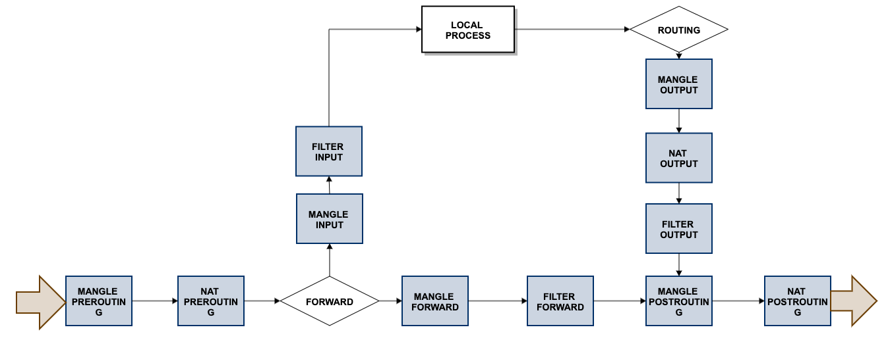

# 一、 Iptables 简介

​	iptables是运行在用户空间的应用软件，通过控制Linux内核netfilter模块，来管理网络数据包的处理和转发。在大部分Linux发行版中，可以通过 手册页 （页面存档备份，存于互联网档案馆） 或 man iptables 获取用户手册。通常iptables需要内核模块支持才能运行，此处相应的内核模块通常是Xtables。因此，iptables操作需要超级用户权限，其可执行文件通常位于 /sbin/iptables 或 /usr/sbin/iptables 。同时，需要说明的是，以上命令通常只用于处理 IPv4 数据包；而对于 IPv6 数据包，则使用类似的 ip6tables 命令。[1]

​	目前，iptables 支持内核2.4以上版本，旧版内核环境下则使用ipchains（于2.2版内核）或 ipwadm（于2.0版内核）完成类似的功能。2014年1月19日起发行的Linux内核3.13版则使用nftables取而代之，但仍然提供 iptables 命令做为兼容接口。

# 二、 Iptables 名词

>  iptables、ip6tables等都使用Xtables框架。存在“表（tables）”、“链（chain）”和“规则（rules）”三个层面。

​	每个“表”指的是不同类型的数据包处理流程，如filter表表示进行数据包过滤，而nat表针对连接进行地址转换操作。每个表中又可以存在多个“链”，系统按照预订的规则将数据包通过某个内建链，例如将从本机发出的数据通过OUTPUT链。在“链”中可以存在若干“规则”，这些规则会被逐一进行匹配，如果匹配，可以执行相应的动作，如修改数据包，或者跳转。跳转可以直接接受该数据包或拒绝该数据包，也可以跳转到其他链继续进行匹配，或者从当前链返回调用者链。当链中所有规则都执行完仍然没有跳转时，将根据该链的默认策略（“policy”）执行对应动作；如果也没有默认动作，则是返回调用者链。[3]

## （1）filter表

filter表是默认的表，如果不指明表则使用此表。其通常用于过滤数据包。其中的内建链包括：

- INPUT，输入链。发往本机的数据包通过此链。
- OUTPUT，输出链。从本机发出的数据包通过此链。
- FORWARD，转发链。本机转发的数据包通过此链。

## （2）nat 表

nat表如其名，用于地址转换操作。其中的内建链包括：

- PREROUTING，路由前链，在处理路由规则前通过此链，通常用于目的地址转换（DNAT）。
- POSTROUTING，路由后链，完成路由规则后通过此链，通常用于源地址转换（SNAT）。
- OUTPUT，输出链，类似PREROUTING，但是处理本机发出的数据包。

## （3）mangle表

mangle表用于处理数据包。其和nat表的主要区别在于，nat表侧重连接而mangle表侧重每一个数据包。其中内建链列表如下。

- PREROUTING
- OUTPUT
- FORWARD
- INPUT
- POSTROUTING

## （4）raw表

raw表用于处理异常，有如下两个内建链：

- PREROUTING
- OUTPUT

# 三、Iptables 工作流

## （1）完整

## （2）基本

# 四、Iptables 命令

